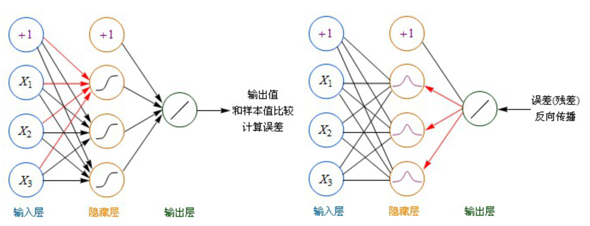
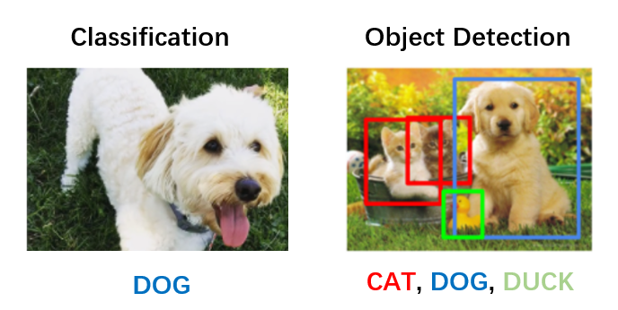
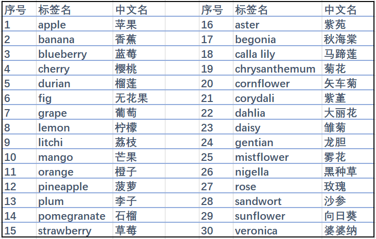
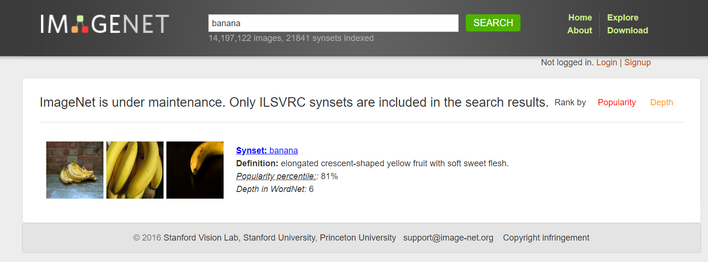
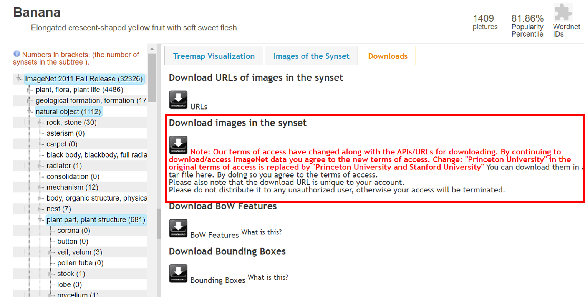
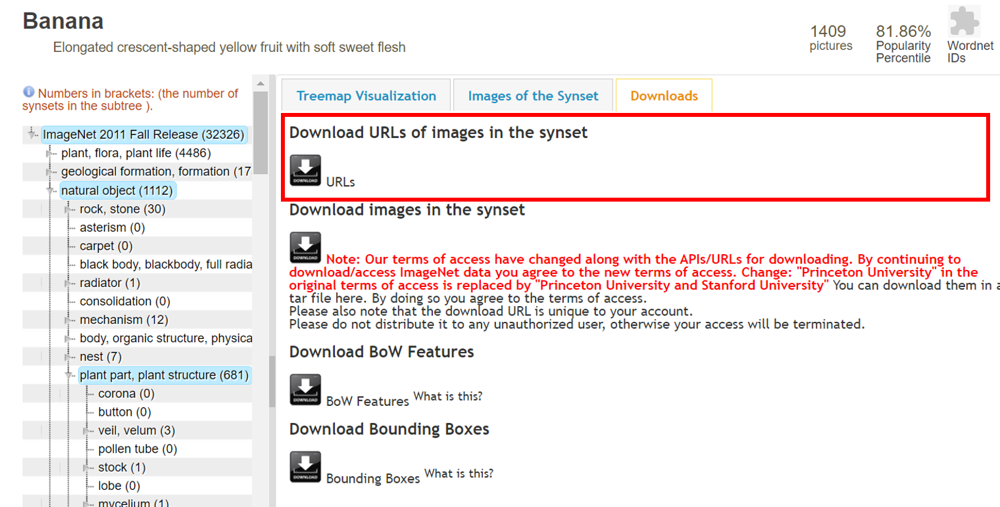
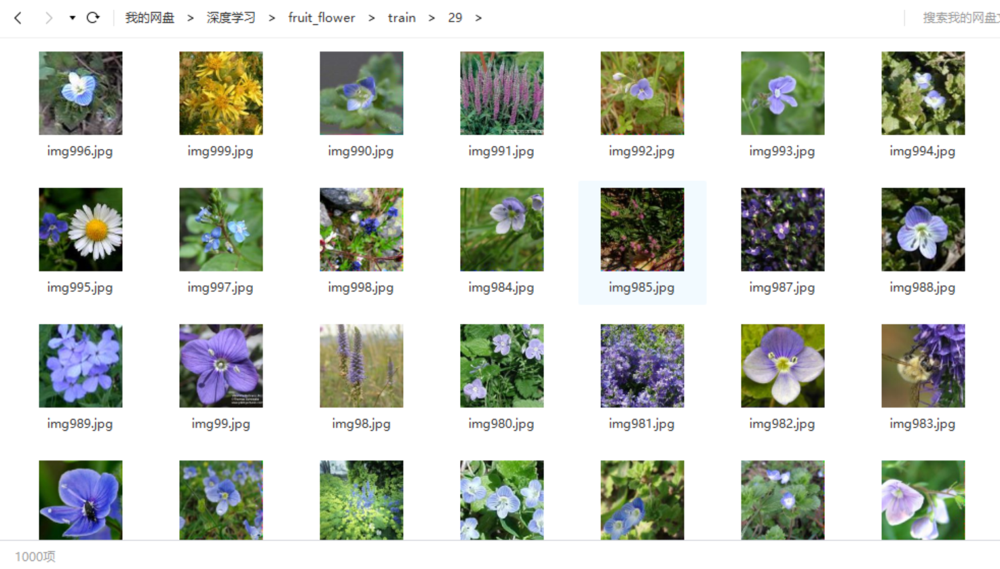
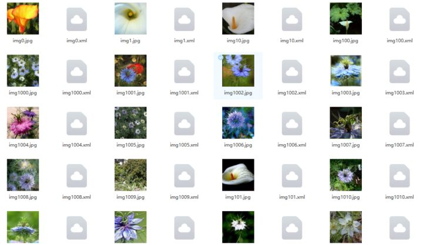

## 一、数据获取及预处理

### 1.1 数据的要求及意义

- 数据集规模较大
- 数据集干净且高质量

**图像识别**和**目标检测**指利用计算机对图像进行处理、分析和理解，以识别各种不同模式的目标和对象的技术，也是深度学习算法的一种实践应用。

而一个成熟的深度学习算法的训练，首先需要大量相关数据来做支撑。

> 简单介绍一下图像识别领域所常用的卷积神经网络的结构  ：
>
> 
>
> 1、使用神经网络将数据进行正向传播，计算误差得到损失函数。
>
> 2、通过整个网络的反向传播计算梯度。
>
> 3、用梯度更新网络中的参数或者权重，得到最终算法。

由此可以看出，数据的规模与干净程度对图像识别算法的准确度起着至关重要的作用。 

### 1.2 数据集的选择

#### 1.2.1 数据简介

在本项目中，我们需要训练两种模型，分别是图像分类模型与目标检测模型。

+ 图像分类：预测图像类别的任务被称为图像分类。训练图像分类模型的目的是识别各类图像。
+ 目标检测：目标检测可以识别出已知的物体和该物体在图片中的位置，并判断出物体对应的类别。

这两种模型在输入模型的训练数据上略有差距，所需的图片数据一共分为两种，普通图片数据和目标检测数据。

图像分类模型需要维度相同的图片作为训练集，一般图片均处理成.jpg格式。目标检测模型除了图片之外，还需要边界框的数据，这种数据以.xml格式储存。

图像分类与目标检测所需数据类型分别如下所示：



#### 1.2.2 识别种类的确定

花卉与水果种类繁多，首先需要确定种类再进行相关图片数据的收集。我们以领域内常用的花卉水果种类为导向进行数据获取，最终确定了以下花卉水果味识别种类。



### 1.3 数据集获取

#### 1.3.1 数据集来源

##### 1.现有数据集

目前在各个图片分类与目标检测的数据集中，已经存在了较为完善的花卉与水果图片。如ImageNet、百度paddle数据库等，我们将各个数据库中的水果和花卉数据进行整合，并形成了我们自己的数据集。

在我们的花卉与水果识别项目中，所选用数据集如下所示：

+ ImageNet：http://www.image-net.org/
+ Oxford 102 Flowers：https://www.robots.ox.ac.uk/~vgg/data/flowers/102/
+ Kaggle中数据集

  +  Fruit Images for Object Detection：https://www.kaggle.com/mbkinaci/fruit-images-for-object-detection
  +  Flower Recognition：https://www.kaggle.com/alxmamaev/flowers-recognition
+ 百度paddle中数据集

  + PaddleDetection水果目标检测：https://aistudio.baidu.com/aistudio/datasetdetail/34327
  + 水果分类模型：https://aistudio.baidu.com/aistudio/datasetdetail/30069

##### 2.爬虫获取图片

水果及花卉图片属于较为常见的图片，根据关键字搜索可以获得数量较多的图片。

我们在获取图片时，使用python爬虫，对google图库以及百度图库进行搜索，并将爬取的图片进行分类。下载好的数据会经过人工筛选，最后放入使用的数据集当中。

#### 1.3.2 数据集下载

在图像识别领域，已经有了很多成熟的数据库，我们可以从中选取自己所需的内容进行下载。

 这里我们以最经典的ImageNet数据库为例，简单介绍一下此类数据集的下载方式：

> 在目标检测领域，ImageNet提供了丰富的目标检测原始数据，包括了不同种类的花卉和水果。我们在ImageNet官网上，下载目标检测所需的数据。
>
> ImageNet是一个不可用于商业目的的数据集，用户下载的话首先需要进行注册。  
>
> 1、完成注册后，首先搜索需要的图片，这里我们以香蕉banana为例：
>
> 2、点击Downloads，下载对应的数据图片。
>
> 3、除此之外，imagenet还提供了图片的原始网站，我们在下载图片时可以使用爬虫，对原始图片直接进行爬取。首先将网址复制，保存到本地：
>
> 3、接下来我们用如下的代码，逐个下载对应的图片：
>
> ```python
> from urllib import request
> 
> urlpath = './text.txt' # 保存的图片网址
> imgpath = './image' # 图片下载后保存地址
> file = open(urlpath, 'r')
> i = 0
> for line in file:
> try:
>   temp = imgpath+str(i)+'.jpg'
>   request.urlretrieve(line, temp)
>   i += 1
> except:
>   print("%s timeout " % line)
>   pass
> file.close()
> ```

#### 1.3.3 python爬虫

此外我们的数据更多地来源于爬虫获取。

这里我们以谷歌与百度为例，为大家介绍一下如何爬取指定关键字的图片。

> 第一步先将谷歌查询网址、指定关键字、Chrome驱动程序在电脑中的位置进行变量的定义。
>
> ```python
> base_url_part1 = 'https://www.google.com/search?q='
> base_url_part2 = '&source=lnms&tbm=isch'
> search_query = '猕猴桃'
> location_driver = '/home/LQ/Downloads/ChromeDriver/chromedriver'
> ```
>
> 然后用这些变量在函数中初始化实例
>
> ```python
> class Crawler:    
> def __init__(self):
>   self.url = base_url_part1 + search_query + base_url_part2
> ```
>
> 接下来我们启动Chrome浏览器驱动，并打开爬取页面
>
> ```python
> def start_brower(self):
>   chrome_options = Options()
>   chrome_options.add_argument("--disable-infobars")
>   driver = webdriver.Chrome(executable_path=location_driver, chrome_options=chrome_options)
>   # 最大化窗口，因为每一次爬取只能看到视窗内的图片
>   driver.maximize_window()
>   # 浏览器打开爬取页面
>   driver.get(self.url)
>   return driver
> ```
>
> 然后我们通过获取页面源码，利用Beautifulsoup4创建soup对象并进行页面解析，再通过soup对象中的findAll函数图像信息提取，就可以将需要的图片下载到指定的本地文件位置里了。
>
> ```python
> def downloadImg(self, driver):
>   t = time.localtime(time.time())
>   foldername = str(t.__getattribute__("tm_year")) + "-" + str(t.__getattribute__("tm_mon")) + "-" + \
>                str(t.__getattribute__("tm_mday"))
>   picpath = '/home/LQ/ImageDownload/%s' % (foldername)
>   if not os.path.exists(picpath): os.makedirs(picpath)
> 
>   img_url_dic = {}
>   x = 0
>   pos = 0
>   for i in range(1):  # 设置爬取范围
>       pos = i * 500
>       js = "document.documentElement.scrollTop=%d" % pos
>       driver.execute_script(js)
>       time.sleep(1)
>       html_page = driver.page_source
>       soup = bs(html_page, "html.parser")
>       imglist = soup.findAll('img', {'class': 'rg_ic rg_i'})
>       for imgurl in imglist:
>           try:
>               print(x, end=' ')
>               if imgurl['src'] not in img_url_dic:
>                   target = '{}/{}.jpg'.format(picpath, x)
>                   img_url_dic[imgurl['src']] = ''
>                   urllib.request.urlretrieve(imgurl['src'], target)
>                   time.sleep(1)
>                   x += 1
>           except KeyError:
>               print("Error")
>               continue
> ```
>
> 在百度图片获取数据也是同样的原理，只需更改初始变量定义。
>
> ```python
> base_url_part1 = 'https://image.baidu.com/search'
> base_url_part2 = '&oq=bagua&rsp=0'
> search_query = '猕猴桃'
> location_driver = 'D:/download/Chrome/Chrome-driver/chromedriver.exe'
> ```

### 1.4 数据预处理

在获取了足够的数据之后，需要对其进行预处理，才能投入最后的训练使用。

接下来我们分别对图像分类数据与目标检测数据进行预处理。

#### 1.4.1 图像分类数据

##### 1.图片格式

首先，我们需要对数据格式进行统一，统一为jpg格式，方便之后数据的读取。

首先定义图像处理函数：

```python
from PIL import Image

def IsValidImage(img_path):
    bValid = True
    try:
        Image.open(img_path).verify()
    except:
        bValid = False
    return bValid

def transimg(img_path):
    if IsValidImage(img_path):
        try:
            str = img_path.rsplit(".", 1)
            output_img_path = str[0] + ".jpg"
            im = Image.open(img_path)
            im.save(output_img_path)
            return True
        except:
            return False
    else:
        return False
```

接下来以处理水果数据为例，读取数据所在文件夹，将原有数据重新命名，并统一为jpg格式，修改完成后储存到新的文件夹当中：

```python
import os
import random
import shutil
import string

# 原始数据文件夹
path = './data/fruit/'
# 处理过后图片
finalpath = './fruit_flower/'

# 逐个文件夹遍历
for items1 in os.listdir(path):
    i = 0
    path1 = path + items1 + '/'
    path_final = finalpath + items1 + '/'
    # 判断文件夹是否存在，如不存在则创建新文件夹
    if not os.path.exists(path_final):
        os.mkdir(path_final)
    if os.listdir(path_final):
        shutil.rmtree(path_final)
        os.mkdir(path_final)
    # 遍历各个图片
    for items2 in os.listdir(path1):
        path2 = path1 + items2 + '/'
        for items3 in os.listdir(path2):
            path3 = path2 + items3 + '/'
            for items4 in os.listdir(path3):
                img_path = path3 + items4
                transimg(img_path)
                a = ''.join(random.choices(string.ascii_lowercase, k=20))
                os.rename(img_path, path3+a+'.jpg')
                shutil.copy(path3+a+'.jpg', path_final)
                os.rename(path_final+a+'.jpg', path_final+str(i)+'.jpg')
                i += 1
```

##### 2.图片通道处理

在爬取图片或下载的数据图片当中，会存在一部分黑白图片。黑白图片为单通道图片，维度与彩色图片不同。

在本步骤里，我们需要查看图片是否均为彩色图片，如果并非彩色图片而是黑白图片，则删除对应图片，保证所有图片均为三通道图片。

具体处理代码如下所示：

```python
# 已处理过格式的图片
path = './fruit_flower/'

#逐个文件夹遍历
for item1 in os.listdir(path):
    path1 = path + item1 + '/'
    print(item1)
    for item2 in os.listdir(path1):
        path2 = path1 + item2
        # 判断是否格式错误
        if os.path.getsize(path2) == 0:
            print(path2)
        else:
            img = Image.open(path2)
            # 判断是否为彩色图片
            if np.shape(img_array.shape)[0] != 3:
                print('p', path2)
                os.remove(path2)
```

我们对图片的处理以基本完成，用如下代码查看每种分类图片个数：

```python
# 分别打印出图片对应种类名，以及每类的图片张数
for item1 in os.listdir(path):
    path1 = path + item1 + '/'
    print(item1)
    t=0
    for item2 in os.listdir(path1):
        t += 1
    print(t)
```

##### 3.数据集划分

在训练的过程中，我们需要使用到训练集与测试集。

我们对数据进行划分，将其以10:1的比例分为测试集和训练集。首先读取对应数据，打乱数据后以对应比例划分训练集与验证集，具体代码如下：

```python
# 图片所在文件夹
path = './fruit_flower/'
# 生成测试集与训练集文件夹
newpath = './fruit_flower/train/'
testpath = './fruit_flower/test/'

# 判断是否存在文件夹
if not os.path.exists(newpath):
    os.mkdir(newpath)
if not os.path.exists(testpath):
    os.mkdir(testpath)

# 逐个文件夹进行遍历
for items1 in os.listdir(path):
    path1 = path + items1 + '/'
    newpath1 = newpath + str(i1) + '/'
    testpath1 = testpath + str(i1) + '/'
    i = 0
    # 判断是否存在文件夹
    if not os.path.exists(newpath1):
        os.mkdir(newpath1)
    if os.listdir(newpath1):
        shutil.rmtree(newpath1)
        os.mkdir(newpath1)
    if not os.path.exists(testpath1):
        os.mkdir(testpath1)
    if os.listdir(testpath1):
        shutil.rmtree(testpath1)
        os.mkdir(testpath1)
    # 逐个图片遍历
    for items2 in os.listdir(path1):
        i += 1
    # 随机生成序列，进行洗牌
    resultList = random.sample(range(0, i), 1100)
    # 将训练集以10:1划分
    for t in range(1100):
        if t < 1000:
            shutil.copy(path1 + str(resultList[t]) + '.jpg', newpath1)
            os.rename(newpath1 + str(resultList[t]) + '.jpg', newpath1 + 'img' + str(t+1) + '.jpg')
        else:
            shutil.copy(path1 + str(resultList[t]) + '.jpg', testpath1)
            os.rename(testpath1 + str(resultList[t]) + '.jpg', testpath1 + 'img' + str(t + 1) + '.jpg')
```

接着我们便得到了处理好的图像分类数据。



我们已经将数据开源，并存放于百度网盘当中。

关于数据集的下载详见：链接：https://pan.baidu.com/s/1N0DybQfNV_4JWCRTYd7SKw 
提取码：3ey9
复制这段内容后打开百度网盘手机App，操作更方便哦--来自百度网盘超级会员V1的分享

#### 1.4.2目标检测数据

接下来我们处理目标检测数据，因为在接下来的训练中，我们使用Tensorflow2 Object Detection的API进行训练，所以我们将所有数据处理为.tfrecord格式，方便后期训练。

我们选取imagenet中16种分类不同的花卉和水果，进行目标检测的训练。

##### 1.数据合并

我们将下载好的各类目标检测数据进行合并，将图片与标注文件进行匹配，并将所有处理好的数据放入一个文件夹内。首先将我们选取好的目标检测数据进行合并：

```python
# 初始数据文件夹爱
path = './newimg/flower/'
# 新数据文件夹
newimg = './newimg/combine/'
t = 0

# 判断是否存在文件夹
if not os.path.exists(newimg):
    os.mkdir(newimg)
if os.listdir(newimg):
    shutil.rmtree(newimg)
    os.mkdir(newimg)

# 逐个文件夹进行遍历
for items1 in os.listdir(path):
    path1 = ori1 + items1 + '/'
    i = 0
    for items2 in os.listdir(path1):
        i += 1
    print(int((i/2)+1))
    for p in range(1, int((i/2)+1)):
        shutil.copy(path1 + str(p) + '.jpg', newimg)
        shutil.copy(path1 + str(p) + '.xml', newimg)
        os.rename(newimg + str(p) + '.jpg', newimg + 'img' + str(t) + '.jpg')
        os.rename(newimg + str(p) + '.xml', newimg + 'img' + str(t) + '.xml')
        t += 1
```

##### 2.TFRecord数据

首先需要将所有的xml相关信息进行汇总，并放入csv列表中，方便TFRecord数据的生成。

我们用如下代码生成csv列表：

```python
import xml.etree.ElementTree as ET

def xml_to_csv(path):
    xml_list = []
    for xml_file in glob.glob(path + '/*.xml'):
        tree = ET.parse(xml_file)
        root = tree.getroot()
        for member in root.findall('object'):
            value = (root.find('filename').text,
                     int(root.find('size')[0].text),
                     int(root.find('size')[1].text),
                     member[0].text,
                     int(member[4][0].text),
                     int(member[4][1].text),
                     int(member[4][2].text),
                     int(member[4][3].text)
                     )
            xml_list.append(value)
    column_name = ['filename', 'width', 'height', 'class', 'xmin', 'ymin', 'xmax', 'ymax']
    xml_df = pd.DataFrame(xml_list, columns=column_name)
    return xml_df

for folder in ['train','test']:
    image_path = os.path.join(os.getcwd(), ('images/' + folder))
    xml_df = xml_to_csv(image_path)
    xml_df.to_csv(('images/' + folder + '_labels.csv'), index=None)
    print('Successfully converted xml to csv.')
```

接下来在文件夹中，生成了对应的csv列表。

我们使用如下代码，将所有图片和标注文件合并为一个TFRecord文件。

以下的代码参考了github中的Raccoon Detector Dataset项目：https://github.com/datitran/raccoon_dataset

具体的处理代码如下：

```python
from __future__ import division
from __future__ import print_function
from __future__ import absolute_import

import os
import io
import pandas as pd
import tensorflow.compat.v1 as tf
from PIL import Image
import dataset_util
from collections import namedtuple, OrderedDict


flags = tf.app.flags
flags.DEFINE_string('csv_input', '', 'Path to the CSV input')
flags.DEFINE_string('image_dir', '', 'Path to the image directory')
flags.DEFINE_string('output_path', '', 'Path to output TFRecord')
FLAGS = flags.FLAGS


# 放入对应的列表名称
def class_text_to_int(row_label):
    if row_label == 'apple':
        return 1
    else:
        None

def split(df, group):
    data = namedtuple('data', ['filename', 'object'])
    gb = df.groupby(group)
    return [data(filename, gb.get_group(x)) for filename, x in zip(gb.groups.keys(), gb.groups)]

def create_tf_example(group, path):
    with tf.gfile.GFile(os.path.join(path, '{}'.format(group.filename)), 'rb') as fid:
        encoded_jpg = fid.read()
    encoded_jpg_io = io.BytesIO(encoded_jpg)
    image = Image.open(encoded_jpg_io)
    width, height = image.size

    filename = group.filename.encode('utf8')
    image_format = b'jpg'
    xmins = []
    xmaxs = []
    ymins = []
    ymaxs = []
    classes_text = []
    classes = []
    for index, row in group.object.iterrows():
        xmins.append(row['xmin'] / width)
        xmaxs.append(row['xmax'] / width)
        ymins.append(row['ymin'] / height)
        ymaxs.append(row['ymax'] / height)
        classes_text.append(row['class'].encode('utf8'))
        classes.append(class_text_to_int(row['class']))
    tf_example = tf.train.Example(features=tf.train.Features(feature={
        'image/height': dataset_util.int64_feature(height),
        'image/width': dataset_util.int64_feature(width),
        'image/filename': dataset_util.bytes_feature(filename),
        'image/source_id': dataset_util.bytes_feature(filename),
        'image/encoded': dataset_util.bytes_feature(encoded_jpg),
        'image/format': dataset_util.bytes_feature(image_format),
        'image/object/bbox/xmin': dataset_util.float_list_feature(xmins),
        'image/object/bbox/xmax': dataset_util.float_list_feature(xmaxs),
        'image/object/bbox/ymin': dataset_util.float_list_feature(ymins),
        'image/object/bbox/ymax': dataset_util.float_list_feature(ymaxs),
        'image/object/class/text': dataset_util.bytes_list_feature(classes_text),
        'image/object/class/label': dataset_util.int64_list_feature(classes),
    }))
    return tf_example


def main(_):
    writer = tf.python_io.TFRecordWriter(FLAGS.output_path)
    path = os.path.join(os.getcwd(), FLAGS.image_dir)
    examples = pd.read_csv(FLAGS.csv_input)
    grouped = split(examples, 'filename')
    for group in grouped:
        tf_example = create_tf_example(group, path)
        writer.write(tf_example.SerializeToString())

    writer.close()
    output_path = os.path.join(os.getcwd(), FLAGS.output_path)
    print('Successfully created the TFRecords: {}'.format(output_path))


if __name__ == '__main__':
    tf.app.run()
```

将以上代码保存为generate_tfrecord.py文件。

使用如下命令，分别生成训练集数据以及测试集数据：

```
python generate_tfrecord.py --csv_input=images\train_labels.csv --image_dir=images\train --output_path=train.record
python generate_tfrecord.py --csv_input=images\test_labels.csv --image_dir=images\test --output_path=test.record
```

上述命令将生成train.record和test.record文件，这两个数据文件将会使用在后续的目标检测训练中。

我们已经将数据开源，并存放于百度网盘当中。



关于目标检测数据集的下载详见百度网盘 ：

目标检测数据集链接：[https://pan.baidu.com/s/1IJ6xjvHv_WHje9d3XbtX1Q](https://link.zhihu.com/?target=https%3A//pan.baidu.com/s/1IJ6xjvHv_WHje9d3XbtX1Q)

提取码：xnkt