[TOC]

# 树莓派zero图像分类与目标检测

> 山东大学（威海）
>
> 数据科学与人工智能实验班

## 简介

树莓派zero图像分类与目标检测是深度学习的研究项目，旨在通过深度学习算法，实现树莓派的实时识别与分类。

在树莓派上运行深度学习主要分为以下几个步骤：

+ 首先是数据的获取及预处理，图像分类与目标检测需要大量干净且高质量的图片数据进行训练，我们需要通过不同方式，尽可能多的获取到相关的图片数据，并处理为深度学习可用的形式。
+ 接下来先实现图像分类，根据深度学习领域存在的相关模型，选择适合于树莓派上运行的深度学习模型。通过Tensorflow2搭建深度学习框架，通过对模型参数不断调整，训练出正确率高且能快速运行的模型。通过对模型的不断改进，在保持模型正确率的同时，减小模型的大小。
+ 目标检测模型也是一个侧重点，我们选择轻量级的深度学习模型，并使用Tensorflow2 Object Detection进行模型的训练，能够进行水果和花卉物体的准确检测，做到一张图片中正确识别多个不同物体的位置与种类。
+ 最后是图像分类模型与目标检测模型分别的部署，将训练好的模型部署到树莓派中，并利用摄像头实时对数据进行处理，做到图片的实时检测。

## 一、数据获取及预处理

### 1.1 数据的要求及意义

- 数据集规模较大
- 数据集干净且高质量

**图像识别**和**目标检测**指利用计算机对图像进行处理、分析和理解，以识别各种不同模式的目标和对象的技术，也是深度学习算法的一种实践应用。

而一个成熟的深度学习算法的训练，首先需要大量相关数据来做支撑。

> 简单介绍一下图像识别领域所常用的卷积神经网络的结构  ：
>
> 
>
> 1、使用神经网络将数据进行正向传播，计算误差得到损失函数。
>
> 2、通过整个网络的反向传播计算梯度。
>
> 3、用梯度更新网络中的参数或者权重，得到最终算法。

由此可以看出，数据的规模与干净程度对图像识别算法的准确度起着至关重要的作用。 

### 1.2 数据集的选择

#### 1.2.1 数据简介

在本项目中，我们需要训练两种模型，分别是图像分类模型与目标检测模型。

+ 图像分类：预测图像类别的任务被称为图像分类。训练图像分类模型的目的是识别各类图像。
+ 目标检测：目标检测可以识别出已知的物体和该物体在图片中的位置，并判断出物体对应的类别。

这两种模型在输入模型的训练数据上略有差距，所需的图片数据一共分为两种，普通图片数据和目标检测数据。

图像分类模型需要维度相同的图片作为训练集，一般图片均处理成.jpg格式。目标检测模型除了图片之外，还需要边界框的数据，这种数据以.xml格式储存。

图像分类与目标检测所需数据类型分别如下所示：


#### 1.2.2 识别种类的确定

花卉与水果种类繁多，首先需要确定种类再进行相关图片数据的收集。我们以领域内常用的花卉水果种类为导向进行数据获取，最终确定了以下花卉水果味识别种类。


### 1.3 数据集获取

#### 1.3.1 数据集来源

##### 1.现有数据集

目前在各个图片分类与目标检测的数据集中，已经存在了较为完善的花卉与水果图片。如ImageNet、百度paddle数据库等，我们将各个数据库中的水果和花卉数据进行整合，并形成了我们自己的数据集。

在我们的花卉与水果识别项目中，所选用数据集如下所示：

+ ImageNet：http://www.image-net.org/
+ Oxford 102 Flowers：https://www.robots.ox.ac.uk/~vgg/data/flowers/102/
+ Kaggle中数据集

  +  Fruit Images for Object Detection：https://www.kaggle.com/mbkinaci/fruit-images-for-object-detection
  +  Flower Recognition：https://www.kaggle.com/alxmamaev/flowers-recognition
+ 百度paddle中数据集

  + PaddleDetection水果目标检测：https://aistudio.baidu.com/aistudio/datasetdetail/34327
  + 水果分类模型：https://aistudio.baidu.com/aistudio/datasetdetail/30069

##### 2.爬虫获取图片

水果及花卉图片属于较为常见的图片，根据关键字搜索可以获得数量较多的图片。

我们在获取图片时，使用python爬虫，对google图库以及百度图库进行搜索，并将爬取的图片进行分类。下载好的数据会经过人工筛选，最后放入使用的数据集当中。

#### 1.3.2 数据集下载

在图像识别领域，已经有了很多成熟的数据库，我们可以从中选取自己所需的内容进行下载。

 这里我们以最经典的ImageNet数据库为例，简单介绍一下此类数据集的下载方式：

> 在目标检测领域，ImageNet提供了丰富的目标检测原始数据，包括了不同种类的花卉和水果。我们在ImageNet官网上，下载目标检测所需的数据。
>
> ImageNet是一个不可用于商业目的的数据集，用户下载的话首先需要进行注册。  
>
> 1、完成注册后，首先搜索需要的图片，这里我们以香蕉banana为例：
>
> 2、点击Downloads，下载对应的数据图片。
>
> 3、除此之外，imagenet还提供了图片的原始网站，我们在下载图片时可以使用爬虫，对原始图片直接进行爬取。首先将网址复制，保存到本地：
>
> 3、接下来我们用如下的代码，逐个下载对应的图片：
>
> ```python
> from urllib import request
> 
> urlpath = './text.txt' # 保存的图片网址
> imgpath = './image' # 图片下载后保存地址
> file = open(urlpath, 'r')
> i = 0
> for line in file:
>  try:
>      temp = imgpath+str(i)+'.jpg'
>      request.urlretrieve(line, temp)
>      i += 1
>  except:
>      print("%s timeout " % line)
>      pass
> file.close()
> ```

#### 1.3.3 python爬虫

此外我们的数据更多地来源于爬虫获取。

这里我们以谷歌与百度为例，为大家介绍一下如何爬取指定关键字的图片。

> 第一步先将谷歌查询网址、指定关键字、Chrome驱动程序在电脑中的位置进行变量的定义。
>
> ```python
> base_url_part1 = 'https://www.google.com/search?q='
> base_url_part2 = '&source=lnms&tbm=isch'
> search_query = '猕猴桃'
> location_driver = '/home/LQ/Downloads/ChromeDriver/chromedriver'
> ```
>
> 然后用这些变量在函数中初始化实例
>
> ```python
> class Crawler:    
>  def __init__(self):
>      self.url = base_url_part1 + search_query + base_url_part2
> ```
>
> 接下来我们启动Chrome浏览器驱动，并打开爬取页面
>
> ```python
>  def start_brower(self):
>      chrome_options = Options()
>      chrome_options.add_argument("--disable-infobars")
>      driver = webdriver.Chrome(executable_path=location_driver, chrome_options=chrome_options)
>      # 最大化窗口，因为每一次爬取只能看到视窗内的图片
>      driver.maximize_window()
>      # 浏览器打开爬取页面
>      driver.get(self.url)
>      return driver
> ```
>
> 然后我们通过获取页面源码，利用Beautifulsoup4创建soup对象并进行页面解析，再通过soup对象中的findAll函数图像信息提取，就可以将需要的图片下载到指定的本地文件位置里了。
>
> ```python
> def downloadImg(self, driver):
>      t = time.localtime(time.time())
>      foldername = str(t.__getattribute__("tm_year")) + "-" + str(t.__getattribute__("tm_mon")) + "-" + \
>                   str(t.__getattribute__("tm_mday"))
>      picpath = '/home/LQ/ImageDownload/%s' % (foldername)
>      if not os.path.exists(picpath): os.makedirs(picpath)
> 
>      img_url_dic = {}
>      x = 0
>      pos = 0
>      for i in range(1):  # 设置爬取范围
>          pos = i * 500
>          js = "document.documentElement.scrollTop=%d" % pos
>          driver.execute_script(js)
>          time.sleep(1)
>          html_page = driver.page_source
>          soup = bs(html_page, "html.parser")
>          imglist = soup.findAll('img', {'class': 'rg_ic rg_i'})
>          for imgurl in imglist:
>              try:
>                  print(x, end=' ')
>                  if imgurl['src'] not in img_url_dic:
>                      target = '{}/{}.jpg'.format(picpath, x)
>                      img_url_dic[imgurl['src']] = ''
>                      urllib.request.urlretrieve(imgurl['src'], target)
>                      time.sleep(1)
>                      x += 1
>              except KeyError:
>                  print("Error")
>                  continue
> ```
>
> 在百度图片获取数据也是同样的原理，只需更改初始变量定义。
>
> ```python
> base_url_part1 = 'https://image.baidu.com/search'
> base_url_part2 = '&oq=bagua&rsp=0'
> search_query = '猕猴桃'
> location_driver = 'D:/download/Chrome/Chrome-driver/chromedriver.exe'
> ```

### 1.4 数据预处理

在获取了足够的数据之后，需要对其进行预处理，才能投入最后的训练使用。

接下来我们分别对图像分类数据与目标检测数据进行预处理。

#### 1.4.1 图像分类数据

##### 1.图片格式

首先，我们需要对数据格式进行统一，统一为jpg格式，方便之后数据的读取。

首先定义图像处理函数：

```python
from PIL import Image

def IsValidImage(img_path):
    bValid = True
    try:
        Image.open(img_path).verify()
    except:
        bValid = False
    return bValid

def transimg(img_path):
    if IsValidImage(img_path):
        try:
            str = img_path.rsplit(".", 1)
            output_img_path = str[0] + ".jpg"
            im = Image.open(img_path)
            im.save(output_img_path)
            return True
        except:
            return False
    else:
        return False
```

接下来以处理水果数据为例，读取数据所在文件夹，将原有数据重新命名，并统一为jpg格式，修改完成后储存到新的文件夹当中：

```python
import os
import random
import shutil
import string

# 原始数据文件夹
path = './data/fruit/'
# 处理过后图片
finalpath = './fruit_flower/'

# 逐个文件夹遍历
for items1 in os.listdir(path):
    i = 0
    path1 = path + items1 + '/'
    path_final = finalpath + items1 + '/'
    # 判断文件夹是否存在，如不存在则创建新文件夹
    if not os.path.exists(path_final):
        os.mkdir(path_final)
    if os.listdir(path_final):
        shutil.rmtree(path_final)
        os.mkdir(path_final)
    # 遍历各个图片
    for items2 in os.listdir(path1):
        path2 = path1 + items2 + '/'
        for items3 in os.listdir(path2):
            path3 = path2 + items3 + '/'
            for items4 in os.listdir(path3):
                img_path = path3 + items4
                transimg(img_path)
                a = ''.join(random.choices(string.ascii_lowercase, k=20))
                os.rename(img_path, path3+a+'.jpg')
                shutil.copy(path3+a+'.jpg', path_final)
                os.rename(path_final+a+'.jpg', path_final+str(i)+'.jpg')
                i += 1
```

##### 2.图片通道处理

在爬取图片或下载的数据图片当中，会存在一部分黑白图片。黑白图片为单通道图片，维度与彩色图片不同。

在本步骤里，我们需要查看图片是否均为彩色图片，如果并非彩色图片而是黑白图片，则删除对应图片，保证所有图片均为三通道图片。

具体处理代码如下所示：

```python
# 已处理过格式的图片
path = './fruit_flower/'

#逐个文件夹遍历
for item1 in os.listdir(path):
    path1 = path + item1 + '/'
    print(item1)
    for item2 in os.listdir(path1):
        path2 = path1 + item2
        # 判断是否格式错误
        if os.path.getsize(path2) == 0:
            print(path2)
        else:
            img = Image.open(path2)
            # 判断是否为彩色图片
            if np.shape(img_array.shape)[0] != 3:
                print('p', path2)
                os.remove(path2)
```

我们对图片的处理以基本完成，用如下代码查看每种分类图片个数：

```python
# 分别打印出图片对应种类名，以及每类的图片张数
for item1 in os.listdir(path):
    path1 = path + item1 + '/'
    print(item1)
    t=0
    for item2 in os.listdir(path1):
        t += 1
    print(t)
```

##### 3.数据集划分

在训练的过程中，我们需要使用到训练集与测试集。

我们对数据进行划分，将其以10:1的比例分为测试集和训练集。首先读取对应数据，打乱数据后以对应比例划分训练集与验证集，具体代码如下：

```python
# 图片所在文件夹
path = './fruit_flower/'
# 生成测试集与训练集文件夹
newpath = './fruit_flower/train/'
testpath = './fruit_flower/test/'

# 判断是否存在文件夹
if not os.path.exists(newpath):
    os.mkdir(newpath)
if not os.path.exists(testpath):
    os.mkdir(testpath)

# 逐个文件夹进行遍历
for items1 in os.listdir(path):
    path1 = path + items1 + '/'
    newpath1 = newpath + str(i1) + '/'
    testpath1 = testpath + str(i1) + '/'
    i = 0
    # 判断是否存在文件夹
    if not os.path.exists(newpath1):
        os.mkdir(newpath1)
    if os.listdir(newpath1):
        shutil.rmtree(newpath1)
        os.mkdir(newpath1)
    if not os.path.exists(testpath1):
        os.mkdir(testpath1)
    if os.listdir(testpath1):
        shutil.rmtree(testpath1)
        os.mkdir(testpath1)
    # 逐个图片遍历
    for items2 in os.listdir(path1):
        i += 1
    # 随机生成序列，进行洗牌
    resultList = random.sample(range(0, i), 1100)
    # 将训练集以10:1划分
    for t in range(1100):
        if t < 1000:
            shutil.copy(path1 + str(resultList[t]) + '.jpg', newpath1)
            os.rename(newpath1 + str(resultList[t]) + '.jpg', newpath1 + 'img' + str(t+1) + '.jpg')
        else:
            shutil.copy(path1 + str(resultList[t]) + '.jpg', testpath1)
            os.rename(testpath1 + str(resultList[t]) + '.jpg', testpath1 + 'img' + str(t + 1) + '.jpg')
```

接着我们便得到了处理好的图像分类数据。


我们已经将数据开源，并存放于百度网盘当中。

关于数据集的下载详见：链接：https://pan.baidu.com/s/1zUK0LPZ6SO8tl9ri0GQQdw 
提取码：5q9o 
复制这段内容后打开百度网盘手机App，操作更方便哦--来自百度网盘超级会员V1的分享

#### 1.4.2目标检测数据

接下来我们处理目标检测数据，因为在接下来的训练中，我们使用Tensorflow2 Object Detection的API进行训练，所以我们将所有数据处理为.tfrecord格式，方便后期训练。

我们选取imagenet中16种分类不同的花卉和水果，进行目标检测的训练。

##### 1.数据合并

我们将下载好的各类目标检测数据进行合并，将图片与标注文件进行匹配，并将所有处理好的数据放入一个文件夹内。首先将我们选取好的目标检测数据进行合并：

```python
# 初始数据文件夹爱
path = './newimg/flower/'
# 新数据文件夹
newimg = './newimg/combine/'
t = 0

# 判断是否存在文件夹
if not os.path.exists(newimg):
    os.mkdir(newimg)
if os.listdir(newimg):
    shutil.rmtree(newimg)
    os.mkdir(newimg)

# 逐个文件夹进行遍历
for items1 in os.listdir(path):
    path1 = ori1 + items1 + '/'
    i = 0
    for items2 in os.listdir(path1):
        i += 1
    print(int((i/2)+1))
    for p in range(1, int((i/2)+1)):
        shutil.copy(path1 + str(p) + '.jpg', newimg)
        shutil.copy(path1 + str(p) + '.xml', newimg)
        os.rename(newimg + str(p) + '.jpg', newimg + 'img' + str(t) + '.jpg')
        os.rename(newimg + str(p) + '.xml', newimg + 'img' + str(t) + '.xml')
        t += 1
```

##### 2.TFRecord数据

首先需要将所有的xml相关信息进行汇总，并放入csv列表中，方便TFRecord数据的生成。

我们用如下代码生成csv列表：

```python
import xml.etree.ElementTree as ET

def xml_to_csv(path):
    xml_list = []
    for xml_file in glob.glob(path + '/*.xml'):
        tree = ET.parse(xml_file)
        root = tree.getroot()
        for member in root.findall('object'):
            value = (root.find('filename').text,
                     int(root.find('size')[0].text),
                     int(root.find('size')[1].text),
                     member[0].text,
                     int(member[4][0].text),
                     int(member[4][1].text),
                     int(member[4][2].text),
                     int(member[4][3].text)
                     )
            xml_list.append(value)
    column_name = ['filename', 'width', 'height', 'class', 'xmin', 'ymin', 'xmax', 'ymax']
    xml_df = pd.DataFrame(xml_list, columns=column_name)
    return xml_df

for folder in ['train','test']:
    image_path = os.path.join(os.getcwd(), ('images/' + folder))
    xml_df = xml_to_csv(image_path)
    xml_df.to_csv(('images/' + folder + '_labels.csv'), index=None)
    print('Successfully converted xml to csv.')
```

接下来在文件夹中，生成了对应的csv列表。

我们使用如下代码，将所有图片和标注文件合并为一个TFRecord文件。

以下的代码参考了github中的Raccoon Detector Dataset项目：https://github.com/datitran/raccoon_dataset

具体的处理代码如下：

```python
from __future__ import division
from __future__ import print_function
from __future__ import absolute_import

import os
import io
import pandas as pd
import tensorflow.compat.v1 as tf
from PIL import Image
import dataset_util
from collections import namedtuple, OrderedDict


flags = tf.app.flags
flags.DEFINE_string('csv_input', '', 'Path to the CSV input')
flags.DEFINE_string('image_dir', '', 'Path to the image directory')
flags.DEFINE_string('output_path', '', 'Path to output TFRecord')
FLAGS = flags.FLAGS


# 放入对应的列表名称
def class_text_to_int(row_label):
    if row_label == 'apple':
        return 1
    else:
        None

def split(df, group):
    data = namedtuple('data', ['filename', 'object'])
    gb = df.groupby(group)
    return [data(filename, gb.get_group(x)) for filename, x in zip(gb.groups.keys(), gb.groups)]

def create_tf_example(group, path):
    with tf.gfile.GFile(os.path.join(path, '{}'.format(group.filename)), 'rb') as fid:
        encoded_jpg = fid.read()
    encoded_jpg_io = io.BytesIO(encoded_jpg)
    image = Image.open(encoded_jpg_io)
    width, height = image.size

    filename = group.filename.encode('utf8')
    image_format = b'jpg'
    xmins = []
    xmaxs = []
    ymins = []
    ymaxs = []
    classes_text = []
    classes = []
    for index, row in group.object.iterrows():
        xmins.append(row['xmin'] / width)
        xmaxs.append(row['xmax'] / width)
        ymins.append(row['ymin'] / height)
        ymaxs.append(row['ymax'] / height)
        classes_text.append(row['class'].encode('utf8'))
        classes.append(class_text_to_int(row['class']))
    tf_example = tf.train.Example(features=tf.train.Features(feature={
        'image/height': dataset_util.int64_feature(height),
        'image/width': dataset_util.int64_feature(width),
        'image/filename': dataset_util.bytes_feature(filename),
        'image/source_id': dataset_util.bytes_feature(filename),
        'image/encoded': dataset_util.bytes_feature(encoded_jpg),
        'image/format': dataset_util.bytes_feature(image_format),
        'image/object/bbox/xmin': dataset_util.float_list_feature(xmins),
        'image/object/bbox/xmax': dataset_util.float_list_feature(xmaxs),
        'image/object/bbox/ymin': dataset_util.float_list_feature(ymins),
        'image/object/bbox/ymax': dataset_util.float_list_feature(ymaxs),
        'image/object/class/text': dataset_util.bytes_list_feature(classes_text),
        'image/object/class/label': dataset_util.int64_list_feature(classes),
    }))
    return tf_example


def main(_):
    writer = tf.python_io.TFRecordWriter(FLAGS.output_path)
    path = os.path.join(os.getcwd(), FLAGS.image_dir)
    examples = pd.read_csv(FLAGS.csv_input)
    grouped = split(examples, 'filename')
    for group in grouped:
        tf_example = create_tf_example(group, path)
        writer.write(tf_example.SerializeToString())

    writer.close()
    output_path = os.path.join(os.getcwd(), FLAGS.output_path)
    print('Successfully created the TFRecords: {}'.format(output_path))


if __name__ == '__main__':
    tf.app.run()
```

将以上代码保存为generate_tfrecord.py文件。

使用如下命令，分别生成训练集数据以及测试集数据：

```
python generate_tfrecord.py --csv_input=images\train_labels.csv --image_dir=images\train --output_path=train.record
python generate_tfrecord.py --csv_input=images\test_labels.csv --image_dir=images\test --output_path=test.record
```

上述命令将生成train.record和test.record文件，这两个数据文件将会使用在后续的目标检测训练中。
## 二、图像分类模型

### 2.1 模型选择

在得到花果数据集后，最重要的便是选择合适的**图像识别模**型进行学习，从而达到对水果与花卉分类的目的。

首先，我们对历年ILSVRC比赛中出现的经典模型进行学习，总结了多个网络的核心思想与优化方法，为后续模型的选择与优化奠定了基础。

由于花果数据集相对于ImageNet数据集较小，且需要的分类数目只有几十种，直接使用经典模型会使计算时间大大增加，并浪费一定的计算资源。并且最终的模型需要部署到**树莓派**中，所以网络的结构不能过大。

综合以上两点，我们选择了目前适用于移动设备的**轻型模型**，这类模型在保证一定的识别精度的情况下，大大减小了网络结构与参数量，从而减少网络规模。

在比较了常用的三种**轻型网络**（DenseNet、ShuffleNet、MobileNet）后，结合各模型特点与应用于花果数据集后得到的准确率，我们最终选择了**MobileNetV2**作为图像识别模型。

在沿用了原模型中深度可分离卷积与到残差结构的基础上，我们对模型网络结构与参数进行了调整与优化，使其更好地对数据集进行学习，并得到了比原模型更高的准确率。

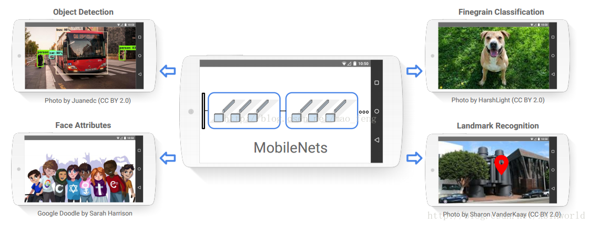

#### 2.1.1 经典模型学习

在图像识别模型的选择过程中，我们首先学习了基于**ImageNet**数据集的ILSVRC比赛中的优秀经典模型，如Alexnet、VGG19、GoogleNet、ResNet等历年的冠/亚军模型。

**层数比较**：

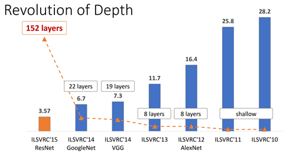

**Top-1准确率**：

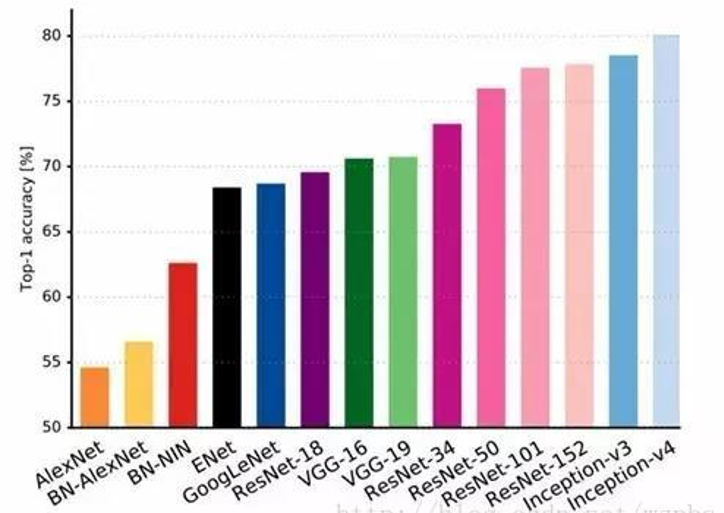

在这些网络中，我们感兴趣的模型有VGG、GoogleNet、ResNet，我们对这些模型的核心思想进行学习，分析了每个网络的结构以及优缺点，并找到各个网络相对于前一个网络的优化点，为我们之后自己的网络提供优化方向，总结如下：


**VGG**

采用连续的几个**3x3的卷积核**代替较大卷积核，作为网络中的卷积核大小搭建模型。

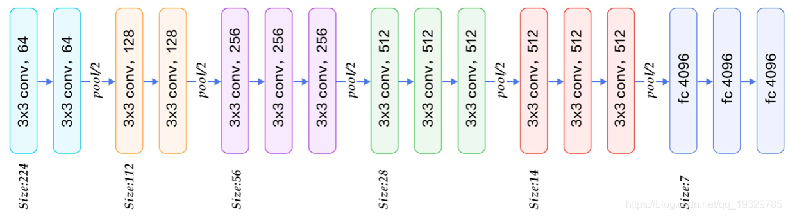

 

**优点**：结构简洁，整个网络都使用了同样大小的卷积核尺寸（3x3）和最大池化尺寸（2x2），通过不断加深网络结构可以提升性能

**缺点**：参数过多，耗费过多计算资源


**GoogleNet**

使用多个**inception模块**（如下图）串联从而形成最终的网络。

inception结构的主要贡献有两个：一是使用1x1的卷积来进行升降维，二是在多个尺寸上同时进行卷积再聚合。

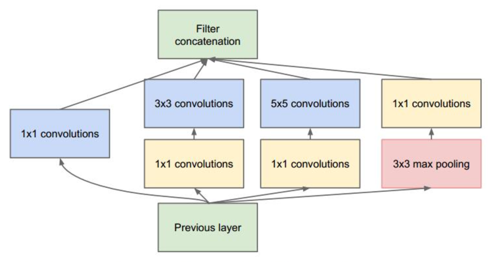

**优点**：增加了网络的深度和宽度，但没有增加计算代价、提升了对网络内部计算资源的利用。


**ResNet**

参考了VGG19网络，在其基础上进行了修改，并通过短路机制加入了**残差块**（Residual Block）

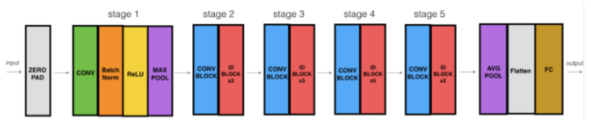

**优点**：首次使用了残差块引入恒等快捷连接，直接跳过一个或多个层，解决了深度神经网络的“退化”问题，即给网络叠加更多的层后，性能却快速下降的情况。


#### 2.1.2 轻型网络的选择

通过将这些网络应用到我们的花果数据集，得出了较高的准确率，但综合考虑了各个网络参数量、计算时间以及花果分类的数据集后，我们决定选择轻型网络作为最终的模型，原因如下：

1. 由于该项目最终需要部署到**树莓派**上，经典网络模型的结构与参数量都过大，无法应用到树莓派
2. 经典网络模型的应用任务往往是大型分类任务，而本项目最终所需要分类的花果仅几十种，实际应用时导致计算资源与时间的浪费。
3. **轻型网络**：在保证一定的识别精度的情况下，大大减小网络结构与参数量，从而减少网络规模。适用于手机、树莓派等移动终端中，如DenseNet、ShuffleNet、MobileNet等。 


**DenseNet**

在ResNet的基础上提出了一个更激进的密集连接机制，互相连接所有的层。

网络由多个**dense block**组成，在dense block中每层的输入是前面所有层的输出concat形成的，结构如下： 

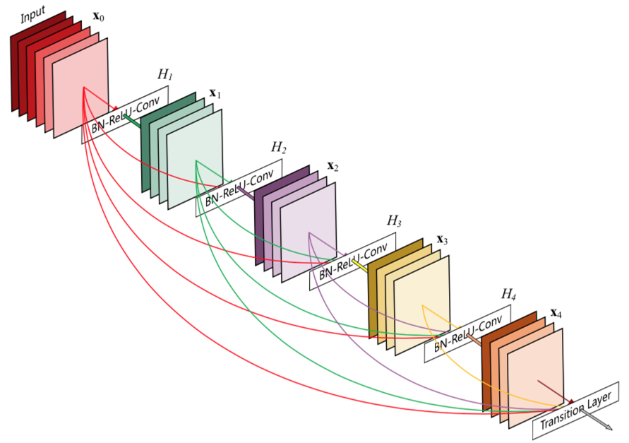

**优点**：加强了feature的传递，并更有效的利用了它、大大减少了参数的数量


**ShuffleNet**

在ResNeXt的基础上，使用**分组逐点卷积**（group pointwise convolution）来代替原来的结构。即通过将卷积运算的输入限制在每个组内，模型的计算量取得了显著的下降。

引入了**组间信息交换的机制**。即对于第二层卷积而言，每个卷积核需要同时接收各组的特征作为输入。 

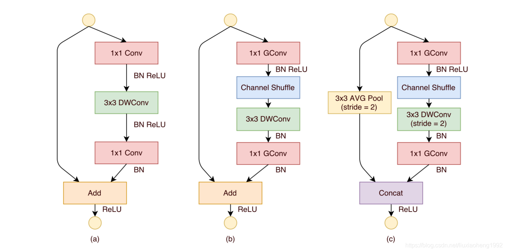

**优点**：原创了三种混洗单元，每个单元都是由逐群卷积和信道混洗组成，这种结构极大的降低了计算代价


**MobileNetV1**

在VGG的基础上，将其中的标准卷积层替换为**深度可分离卷积**，其计算代价是由深度卷积和逐点卷积两部分。并添加了两个超参数：**瘦身乘子**（width multiplier）其取值范围为0~1，用来减少网络的通道数。另外一个参数为**分辨率乘子**（resolution multiplier），该参数将缩放输入图像的尺寸，尺寸范围为224~128之间。

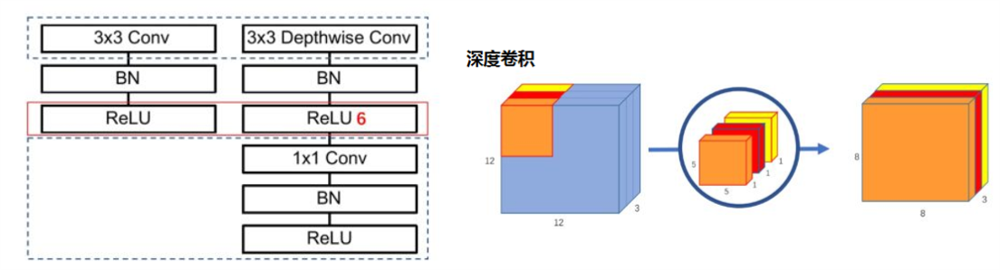

**优点**：使用了深度可分离卷积，大大减少了参数量。并添加了两个超参数，使得在保证了一定准确度的前提下，网络模型进一步缩小


#### 2.1.3 MobileNetV2模型

在V2的网络设计中，除了继续使用V1中的深度可分离卷积之外，还使用了Expansion layer和 Projection layer。

**projection layer**使用1×1的网络结构，目的是将高维特征映射到低维空间去。

**Expansion layer**的功能正相反，在使用1×1的网络结构的同时，目的是将低维特征映射到高维空间。其中的一个超参数决定了将维度扩展几倍 

**网络结构**：先通过Expansion layer来扩展维度，之后用深度可分离卷积来提取特征，而后使用Projection  layer来压缩数据，让网络重新变小。因为Expansion layer 和 Projection  layer都具有可以学习的参数，所以整个网络结构可以学习到如何更好的扩展数据和重新压缩数据。


**优点**：在V1的基础上，使用了**倒残差结构**(Inverted residual block)，即使用Pointwise先对特征图进行升维，在升维后接上Relu，减少Relu对特征的破坏。并引入了**特征复用结构**（ResNet bottleneck） 


最终，通过将几种轻型网络应用于花果数据集后，综合**验证集准确率**以及**树莓派模型适用性**，我们选择了**MobileNetV2**为最终的网络模型，并进行了代码的调整与优化，使其更好地适用于本项目中的花果分类。

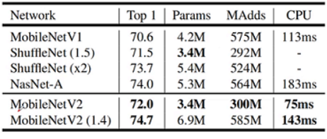


### 2.2 数据准备

我们需要使用我们已经预处理好的花卉与水果数据，图片共有30类，其中花卉与水果各有15类。

每类水果图片包含了1000张训练集，与100张测试集。数据集总共有33000张图片。

| 序号 |   英文名    | 中文名 |      | 序号 |    英文名     | 中文名 |
| :--: | :---------: | :----: | ---- | :--: | :-----------: | :----: |
|  1   |    apple    |  苹果  |      |  16  |     aster     |  紫苑  |
|  2   |   banana    |  香蕉  |      |  17  |    begonia    | 秋海棠 |
|  3   |  blueberry  |  蓝莓  |      |  18  |  calla lily   | 马蹄莲 |
|  4   |   cherry    |  樱桃  |      |  19  | chrysanthemum |  菊花  |
|  5   |   durian    |  榴莲  |      |  20  |  cornflower   | 矢车菊 |
|  6   |     fig     | 无花果 |      |  21  |   corydali    |  紫堇  |
|  7   |    grape    |  葡萄  |      |  22  |    dahlia     | 大丽花 |
|  8   |    lemon    |  柠檬  |      |  23  |     daisy     |  雏菊  |
|  9   |   litchi    |  荔枝  |      |  24  |    gentian    |  龙胆  |
|  10  |    mango    |  芒果  |      |  25  |  mistflower   |  雾花  |
|  11  |   orange    |  橙子  |      |  26  |    nigella    | 黑霉菌 |
|  12  |  pineapple  |  菠萝  |      |  27  |     rose      |  玫瑰  |
|  13  |    plum     |  李子  |      |  28  |   sandwort    |  沙参  |
|  14  | pomegranate |  石榴  |      |  29  |   sunflower   | 向日葵 |
|  15  | strawberry  |  草莓  |      |  30  |   veronica    | 婆婆纳 |

### 2.3 Tensorflow2框架搭建

我们使用Tensorflow2进行深度学习框架的搭建。理由如下：

* 我们在本项目中主要注重模型的最终使用。Tensorflow2在模型部署方面有着相当成熟的API，可以更加快速的进行部署。


* Tensorflow2有封装好的深度学习训练API，如tf.keras，能够快速的搭建模型和使用。

#### 2.3.1 预处理函数

首先我们导入需要使用的python包：

```python
import tensorflow as tf
from tensorflow.keras import layers, models
```

接下来我们定义图像处理函数，我们将图片所在文件夹名作为数据的标签，并将所有图片处理为相同的格式大小。

图片默认处理为224x224格式大小：

```python
def load_image(img_path,size = (224,224)):
    label = tf.cast(tf.compat.v1.string_to_number(tf.strings.split(img_path, sep='/',)[8]), tf.int8)
    img = tf.io.read_file(img_path)
    img = tf.image.decode_jpeg(img)
    img = tf.image.resize(img,size)/255.0
    return(img,label)
```

定义模型训练过程中主要参数：

```python
BATCH_SIZE = 100
EPOCHS = 10
```

导入测试集与训练集，并行化处理数据：

```python
# 数据集文件夹所在路径
datapath = "/content/gdrive/MyDrive/data/classification/"

ds_train = tf.data.Dataset.list_files(datapath+"fruit_flower/train/*/*.jpg") \
           .map(load_image, num_parallel_calls=tf.data.experimental.AUTOTUNE) \
           .shuffle(buffer_size = 1000).batch(BATCH_SIZE) \
           .prefetch(tf.data.experimental.AUTOTUNE)

ds_test = tf.data.Dataset.list_files(datapath+"fruit_flower/test/*/*.jpg") \
           .map(load_image, num_parallel_calls=tf.data.experimental.AUTOTUNE) \
           .batch(BATCH_SIZE) \
           .prefetch(tf.data.experimental.AUTOTUNE)
```

将预处理好的图片用matplotlib画图展示：

```python
from matplotlib import pyplot as plt

plt.figure(figsize=(8,8))
for i,(img,label) in enumerate(ds_train.unbatch().take(9)):
    ax=plt.subplot(3,3,i+1)
    ax.imshow(img.numpy())
    ax.set_title("label = %d"%label)
    ax.set_xticks([])
    ax.set_yticks([])
plt.show()
```

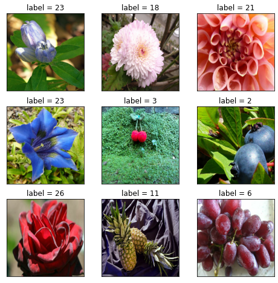

#### 2.3.2 定义MobileNetV2模型

使用Keras接口有以下3种方式构建模型：使用Sequential按层顺序构建模型，使用函数式API构建任意结构模型，继承Model基类构建自定义模型。

这里我们选择使用函数式API构建模型。

我们用Tensorflow2中的tf.keras.applications函数，调用MobileNetV2模型，其中：

+ 输入图片维度设置为(224,224,3)
+ 去除掉原有网络的卷积层
+ 定义新的卷积层

```python
# tf.keras.applications导入模型
Mo = tf.keras.applications.MobileNetV2(
    	input_shape=(224,224,3),
		include_top=False)
Mo.trainable=True

model = models.Sequential()
model.add(Mo)
model.add(layers.GlobalAveragePooling2D())
model.add(layers.Flatten())
model.add(layers.Dense(512, activation='relu'))
model.add(layers.Dropout(rate=0.5))
model.add(layers.Dense(256, activation='relu'))
model.add(layers.Dropout(rate=0.5))
model.add(layers.Dense(30, activation='sigmoid'))
model.summary()
```

```
Model: "sequential_2"
_________________________________________________________________
Layer (type)                 Output Shape              Param #   
=================================================================
mobilenetv2_1.00_224 (Functi (None, 7, 7, 1280)        2257984   
_________________________________________________________________
global_average_pooling2d_2 ( (None, 1280)              0         
_________________________________________________________________
flatten_2 (Flatten)          (None, 1280)              0         
_________________________________________________________________
dense_6 (Dense)              (None, 512)               655872    
_________________________________________________________________
dropout_4 (Dropout)          (None, 512)               0         
_________________________________________________________________
dense_7 (Dense)              (None, 256)               131328    
_________________________________________________________________
dropout_5 (Dropout)          (None, 256)               0         
_________________________________________________________________
dense_8 (Dense)              (None, 30)                7710      
=================================================================
Total params: 3,052,894
Trainable params: 794,910
Non-trainable params: 2,257,984
_________________________________________________________________
```

#### 2.3.3 训练模型

接下来我们开始训练模型，首先设置模型的各个回调函数。其中分别包括：

+ TensorBoard：使用TensorBoard，将训练过程进行可视化。
+ ModelCheckpoint：设置模型的检查点，使模型下次训练时从检查点开始。
+ EarlyStopping：当训练损失函数连续多轮没有变化时，自动停止训练
+ ReduceLROnPlateau：根据训练的迭代次数，逐渐减小学习率，提高学习精度。

以上函数的具体代码如下：

```python
import datetime
import os

stamp = datetime.datetime.now().strftime("%Y%m%d-%H%M%S")
callback_dir = datapath+'model/callback/'+stamp
tensorboard_callback = tf.keras.callbacks.TensorBoard(callback_dir, histogram_freq=1)

checkpoint_path = datapath+'model/checkpoint/'+stamp
model_save = tf.keras.callbacks.ModelCheckpoint(
                filepath=checkpoint_path, 
                verbose=1, 
                save_weights_only=True,
                period=20)

early_stop = tf.keras.callbacks.EarlyStopping(monitor = 'val_loss', min_delta = 0.001, 
                           patience = 5, mode = 'min', verbose = 1,
                           restore_best_weights = True)

reduce_lr = tf.keras.callbacks.ReduceLROnPlateau(monitor = 'val_loss', factor = 0.3, 
                              patience = 2, min_delta = 0.001, 
                              mode = 'min', verbose = 1)
```

导入最新的检查点：

```python
# 如果是初次训练，则不需要调用
checkpoint_dir = datapath+'model/checkpoint/'
latest = tf.train.latest_checkpoint(checkpoint_dir)
model.load_weights(latest)
```

定义模型的优化器以及损失函数：

+ 优化器：Adam优化器，即一种对随机目标函数执行一阶梯度优化的算法，该算法基于适应性低阶矩估计。
+ 损失函数：稀疏分类交叉熵（Sparse Categorical Crossentropy），多类的对数损失，适用于多类分类问题，且接受稀疏标签。

用Tensorflow2内置fit方法开始进行模型训练：

```python
model.compile(
        optimizer=tf.keras.optimizers.Adam(lr=0.001),
        loss=tf.keras.losses.sparse_categorical_crossentropy,
        metrics=["accuracy"])

history = model.fit(ds_train,epochs=EPOCHS,validation_data=ds_test,
                    callbacks = [tensorboard_callback, model_save, early_stop, reduce_lr])
```

### 2.4 模型评估

#### 2.4.1 TensorBoard可视化

TensorBoard可以用于查看训练的进度如何，我们可以在命令行或jupyter notebook中调用TensorBoard，实时查看损失函数的下降情况以及训练的具体进度，这里我们用jupyter notebook进行查看，具体操作如下：

首先导入TensorBoard：

```python
%load_ext tensorboard

from tensorboard import notebook
notebook.list() 
```

接着输入训练对应文件夹，启用TensorBoard：

```python
notebook.start("--logdir "+datapath+"model/callback/")
```

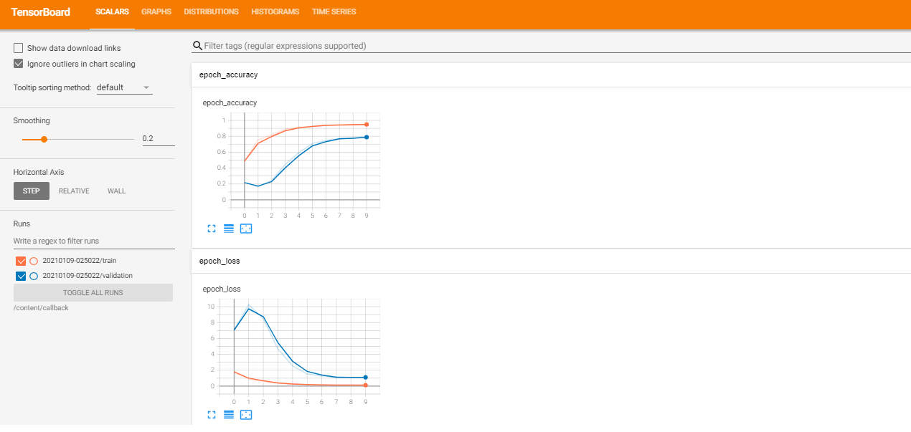

#### 2.4.2 训练正确率查看

我们使用python的pandas包，将每次的迭代正确率和损失以表格的形式呈现：

```python
import pandas as pd

dfhistory = pd.DataFrame(history.history)
dfhistory.index = range(1,len(dfhistory) + 1)
dfhistory.index.name = 'epoch'

print(dfhistory)
```


除此之外，我们将训练中训练集和验证集的正确率与损失函数以图的方式呈现，具体如下：

```python
train_metrics = history.history["loss"]
val_metrics = history.history['val_loss']
epochs = range(1, len(train_metrics) + 1)
plt.plot(epochs, train_metrics, 'bo--')
plt.plot(epochs, val_metrics, 'ro-')
plt.title('Training and validation loss')
plt.xlabel("Epochs")
plt.ylabel("loss")
plt.legend(["train_loss", 'val_loss'])
plt.show()
```

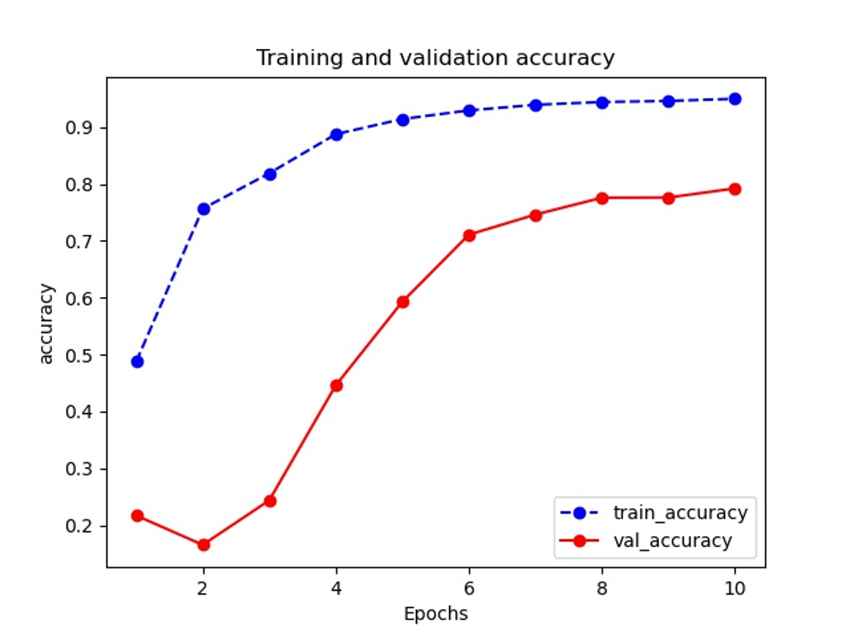

```python
train_metrics = history.history["accuracy"]
val_metrics = history.history['val_accuracy']
epochs = range(1, len(train_metrics) + 1)
plt.plot(epochs, train_metrics, 'bo--')
plt.plot(epochs, val_metrics, 'ro-')
plt.title('Training and validation accuracy')
plt.xlabel("Epochs")
plt.ylabel("accuracy")
plt.legend(["train_accuracy", 'val_accuracy'])
plt.show()
```

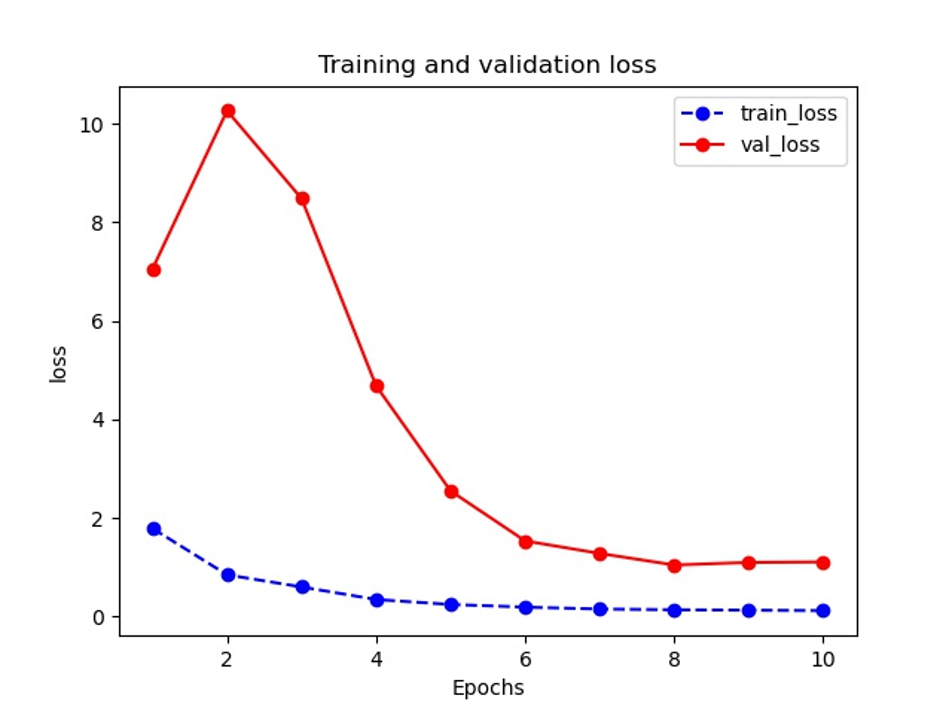

### 2.5 模型改进

在训练模型时要从模型的实际用途进行出发，我们进一步对训练好的模型进行改进。

在接下来的模型改进中，主要从以下两个方面进行考虑：

+ 减小模型的大小，提高模型运算速度
+ 提高模型的准确率

以上改进分别通过输入图片大小调整和网络参数调整来实现，同时我们还通过迁移学习提高模型训练效率。

#### 2.5.1 迁移学习

迁移学习通过下载以训练好的模型权重，减少模型的训练量，加快模型的训练速度。这里我们使用MobileNetV2在ImageNet上训练的权重作为迁移学习的模型。

首先定义模型，并调用迁移学习的参数：

```python
Mo = tf.keras.applications.MobileNetV2(
    	input_shape=(224,224,3),
	include_top=False,
	weights='imagenet')

model = models.Sequential()
model.add(Mo)
model.add(layers.GlobalAveragePooling2D())
model.add(layers.Flatten())
model.add(layers.Dense(512, activation='relu'))
model.add(layers.Dropout(rate=0.3))
model.add(layers.Dense(256, activation='relu'))
model.add(layers.Dropout(rate=0.3))
model.add(layers.Dense(30, activation='sigmoid'))
model.summary()
```

我们控制模型的前20层为不可训练的参数，20层往后为可训练参数：

```python
for layer in Mo.layers[:20]:
   layer.trainable=False
for layer in Mo.layers[20:]:
   layer.trainable=True
```

调用fit函数开始训练模型：

```python
history = model.fit(ds_train,epochs=EPOCHS,validation_data=ds_test,
                    callbacks = [tensorboard_callback, model_save, early_stop, reduce_lr])
```

#### 2.5.2 输入图片大小调整

输入图片的大小决定了卷积神经网络的复杂程度，以及参数的多少。对于较多的分类情况下，如ImageNet数据集，使用的是（224,224,3）维度的图片。但在本项目中，图片的分类较少，为30种，可以使用较小矩阵的图片，我们将图片大小调整为（100,100,3），并重新进行训练，具体如下。

改变函数，调整图片大小：

```python
def load_image(img_path,size = (224,224)):
    label = tf.cast(tf.compat.v1.string_to_number(tf.strings.split(img_path, sep='/',)[8]), tf.int8)
    img = tf.io.read_file(img_path)
    img = tf.image.decode_jpeg(img)
    img = tf.image.resize(img,size)/255.0
    return(img,label)
```

将图片进行可视化：

```python
plt.figure(figsize=(8,8))
for i,(img,label) in enumerate(ds_train.unbatch().take(9)):
    ax=plt.subplot(3,3,i+1)
    ax.imshow(img.numpy())
    ax.set_title("label = %d"%label)
    ax.set_xticks([])
    ax.set_yticks([])
plt.show()
```

重新对模型进行训练：

```python
history = model.fit(ds_train,epochs=EPOCHS,validation_data=ds_test,
                    callbacks = [tensorboard_callback, model_save, early_stop, reduce_lr])
```

#### 2.5.3 网络参数调整

卷积神经网络的参数，以及训练时的超参数很大程度决定了模型的好坏，模型的参数可以从以下几点进行调整：

+ 卷积神经网络参数
  + 网络层的激活函数，选择relu或sigmod
  + dropout层的添加以及参数改变，防止过拟合
  + 网络结构调整，删去冗余网络结构，减小计算量
+ 训练超参数选择
  + 优化器的选择，选择合适的优化器
  + 学习率大小的调整，通过减小学习率来提高精度

以下我们通过调整学习率，以及dropout层的参数，来对模型进行改进。

重新定义模型，调整模型参数：

```python
Mo = tf.keras.applications.MobileNetV2(
    	input_shape=(224,224,3),
		include_top=False)
Mo.trainable=True

model = models.Sequential()
model.add(Mo)
model.add(layers.GlobalAveragePooling2D())
model.add(layers.Flatten())
model.add(layers.Dense(512, activation='relu'))
model.add(layers.Dropout(rate=0.3))
model.add(layers.Dense(256, activation='relu'))
model.add(layers.Dropout(rate=0.3))
model.add(layers.Dense(30, activation='sigmoid'))
model.summary()
```

调整合适的学习率，将学习率从0.001调整至0.0005：

```python
model.compile(
        optimizer=tf.keras.optimizers.Adam(lr=0.0005),
        loss=tf.keras.losses.sparse_categorical_crossentropy,
        metrics=["accuracy"])
```

调用fit函数训练模型：

```python
history = model.fit(ds_train,epochs=EPOCHS,validation_data=ds_test,
                    callbacks = [tensorboard_callback, model_save, early_stop, reduce_lr])
```


## 三、目标检测模型

### 3.1 数据集的选取

在目标检测过程中，我们从图像分类的30种分类中，选取了8种水果，8种花卉（共16种），作为我们的目标检测模型训练数据。具体的选取种类如下：

| 序号 |   英文名   | 中文名 |      | 序号 |   英文名   | 中文名 |
| :--: | :--------: | :----: | ---- | :--: | :--------: | :----: |
|  1   |   apple    |  苹果  |      |  9   | calla lily | 马蹄莲 |
|  2   |   banana   |  香蕉  |      |  10  | cornflower | 矢车菊 |
|  3   |   grape    |  葡萄  |      |  11  | corydalis  | 延胡索 |
|  4   | kiwifruit  | 猕猴桃 |      |  12  |   dahlia   | 大丽花 |
|  5   |   mango    |  芒果  |      |  13  |   daisy    |  雏菊  |
|  6   |   orange   |  橘子  |      |  14  |  gentian   |  龙胆  |
|  7   |    pear    |   梨   |      |  15  |  nigella   | 黑种草 |
|  8   | strawberry |  草莓  |      |  16  | sunflower  | 向日葵 |


### 3.2 数据集获取

在目标检测领域，imagenet提供了丰富的目标检测原始数据，包括了不同种类的花卉和水果。我们在imagenet官网上，下载目标检测所需的数据。

+ 点击imagenet官网：http://www.image-net.org/

+ 搜索我们需要的数据，这里我们以香蕉banana为例：


+ 点击Downloads，分别下载原始图片以及边界框。

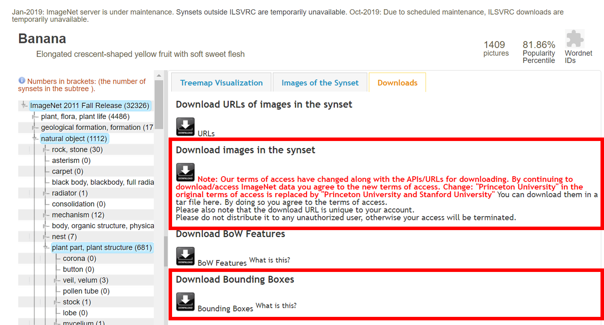

下载好后，我们可以进一步查看我们下载的目标检测数据。LabelImg是目标检测标记图像的工具，它既可以用于标注图片，也可以用于查看目标检测的数据。我们可以在github中下载其最新版本，其github页面上有关于如何安装和使用它的非常清晰的说明。

[LabelImg说明文档](https://github.com/tzutalin/labelImg)

[点击下载LabelImg](https://www.dropbox.com/s/tq7zfrcwl44vxan/windows_v1.6.0.zip?dl=1)

我们将我们下载的images与Bounding Boxes放入同一个文件夹，并用LabelImg打开，具体效果如下：

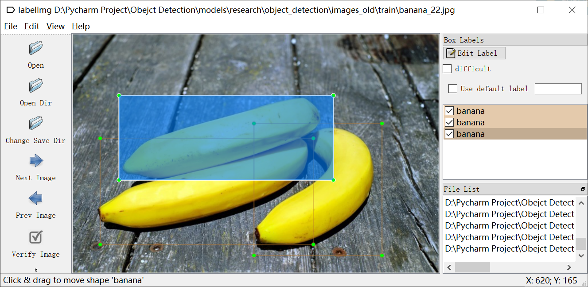

同时我们也可以自己用LabelImg进行数据标注，LabelImg保存一个.xml文件，其中包含每个图像的标签数据。这些.xml文件将用于生成TFRecords，它们是TensorFlow训练的输入之一。

### 3.3 目标检测模型选择

在当前的目标检测领域中，已有较为成熟的研究成果。目前目标检测主要分为两个领域

（1）**two-stage方法**，如R-CNN系算法，其主要思路是先通过启发式方法或者CNN网络（RPN)产生一系列稀疏的候选框，然后对这些候选框进行分类与回归，two-stage方法的优势是准确度高

（2）**one-stage方法**，如Yolo和SSD，其主要思路是均匀地在图片的不同位置进行密集抽样，抽样时可以采用不同尺度和长宽比，然后利用CNN提取特征后直接进行分类与回归，整个过程只需要一步，所以其优势是速度快，但是均匀的密集采样的一个重要缺点是训练比较困难，这主要是因为正样本与负样本极其不均衡，导致模型准确度稍低。

因为我们在之后部署到树莓派的过程中，计算能力有限，所以这里我们选择one-stage方法中的SSD，在移动端仍可以保持较快的运算速度。

同时，我们选择将SSD与MobileNet相结合，生成以MobileNet为基底的SSD-MobileNetV2网络。具体的网络结构如下：

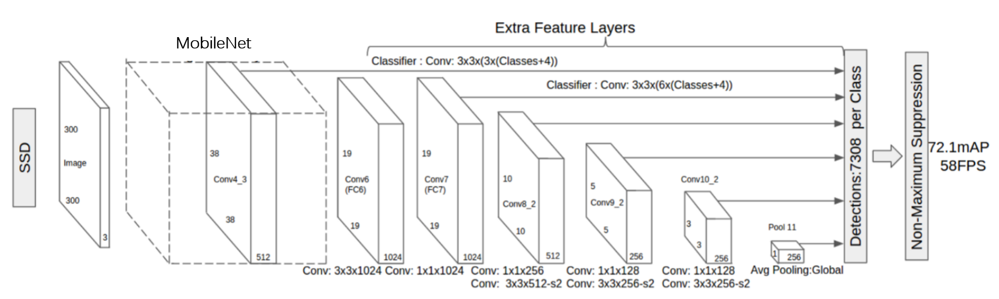

### 3.4 Tensorflow2目标检测API

TensorFlow目标检测API是一个基于TensorFlow的开源框架，可轻松构建，训练和部署对象检测模型。在2020年6月，TensorFlow更新的目标检测，并适用于了TensorFlow2的版本。在本教程内，我们将基于TF2来进行目标检测。

首先我们要从github上克隆完整的Tensorflow object detection仓库，在命令行输入如下命令：

```
git clone https://github.com/tensorflow/models
```

克隆或下载完成后，将models-master重命名为models。

接下来，我们的主要操作全部在 models/research/object_detection 中进行。

同时，我们也可以下载一些预训练好的模型，用于之后模型的训练。我们在TensorFlow目标检测的仓库中可以找到对应的模型，在如下地址下载：

[TF2预训练模型](https://github.com/tensorflow/models/blob/master/research/object_detection/g3doc/tf2_detection_zoo.md)

在本篇文章中，我们主要使用了SSD-MobileNetV2模型，所以点击SSD-MobileNetV2模型进行下载：

[SSD MobileNet v2 320x320](http://download.tensorflow.org/models/object_detection/tf2/20200711/ssd_mobilenet_v2_320x320_coco17_tpu-8.tar.gz)

### 3.5 配置Tensorflow2环境

首先，我们需要使用pip安装tensorflow2版本环境。我们在命令行中输入：

```
pip install tensorflow==2.3.0
```

如果使用的是GPU设备，则安装对应的tensorflow-gpu版本，在安装的同时，系统会自动安装对应的CUDA和cuDNN。

等待一段时间安装好后，我们再安装其他必要的软件包，在命令行中输入：

```
pip install tf_slim
pip install lvis
```

当软件包安装好后，我们需要编译tensorflow目标检测API中的Protobufs，首先切换到对应目录，然后再用protoc命令进行编译：

```
cd models/research
protoc object_detection/protos/*.proto --python_out=.
```

最后我们还需要配置PYTHONPATH环境变量，输入如下命令进行PYTHONPATH环境变量的配置：

```
export PYTHONPATH=$PYTHONPATH:models/research/:models
```

完成TensorFlow对象检测API的所有设置并可以使用了。

### 3.6 生成TFRecords格式数据

接下来我们要生成TFRecords格式的数据，首先保证目标检测的数据已经处理为了如下格式，在文件夹中排列：

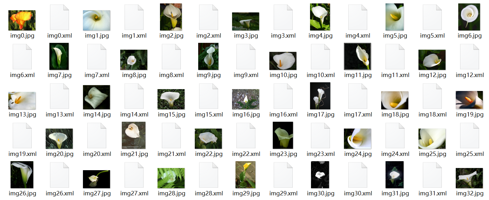

在models/research/object_detection中新建images文件夹。

将这些图片中，以10:1的比例分别放入models/research/object_detection/train，models/research/object_detection/test，用于后续的处理。

处理好图像后，便开始生成TFRecords了，该记录用作TensorFlow训练模型的输入数据。我们使用本教程github仓库中的xml_to_csv.py和generate_tfrecord.py文件。 

首先，图像.xml数据将用于创建.csv文件，其中包含了训练集和测试集的所有数据。首先打开object_detection文件夹，在命令行中运行此命令：

```
python xml_to_csv.py
```

这将在object_detection/images文件夹中创建train_labels.csv和test_labels.csv文件。

接下来，在文本编辑器中打开generate_tfrecord.py文件。并用generate_tfrecord.py生成对应的TFRecords文件，执行以下命令：

```
python generate_tfrecord.py --csv_input=images\train_labels.csv --image_dir=images\train --output_path=training/train.record
python generate_tfrecord.py --csv_input=images\test_labels.csv --image_dir=images\test --output_path=training/test.record
```

执行完命令后，我们便发现在object_detection/training文件夹中有了train.record和test.record文件，这两个文件分别作为之后目标检测的训练集与测试集使用。

### 3.7 目标检测模型训练

在执行训练之前，我们先介绍一下训练所需的各个文件对应的含义。

#### 3.7.1 label_map.pbtxt标签图

标签图通过定义分类名称和对应的分类编号的映射，来说明训练中每个编号对应的内容是什么。我们将标签图放在models/research/object_detection/training文件夹中，并按照对应的格式写好，具体的格式如下：

```
item {
  id: 1
  name: 'apple'
}

item {
  id: 2
  name: 'banana'
}

item {
  id: 3
  name: 'grape'
}

...
```

标签映射ID编号应与generate_tfrecord.py文件中定义的编号相同。

#### 3.7.2 pipeline.config配置

我们在训练不同的目标检测模型时，需要对配置文件进行修改，以下是在训练SSD-MobileNetV2模型时所用到的配置文件，具体如下：

```
model {
  ssd {
    inplace_batchnorm_update: true
    freeze_batchnorm: false
    num_classes: 16
    box_coder {
      faster_rcnn_box_coder {
        y_scale: 10.0
        x_scale: 10.0
        height_scale: 5.0
        width_scale: 5.0
      }
    }
    matcher {
      argmax_matcher {
        matched_threshold: 0.5
        unmatched_threshold: 0.5
        ignore_thresholds: false
        negatives_lower_than_unmatched: true
        force_match_for_each_row: true
        use_matmul_gather: true
      }
    }
    similarity_calculator {
      iou_similarity {
      }
    }
    encode_background_as_zeros: true
    anchor_generator {
      ssd_anchor_generator {
        num_layers: 6
        min_scale: 0.2
        max_scale: 0.95
        aspect_ratios: 1.0
        aspect_ratios: 2.0
        aspect_ratios: 0.5
        aspect_ratios: 3.0
        aspect_ratios: 0.3333
      }
    }
    image_resizer {
      fixed_shape_resizer {
        height: 300
        width: 300
      }
    }
    box_predictor {
      convolutional_box_predictor {
        min_depth: 0
        max_depth: 0
        num_layers_before_predictor: 0
        use_dropout: false
        dropout_keep_probability: 0.8
        kernel_size: 1
        box_code_size: 4
        apply_sigmoid_to_scores: false
        class_prediction_bias_init: -4.6
        conv_hyperparams {
          activation: RELU_6,
          regularizer {
            l2_regularizer {
              weight: 0.00004
            }
          }
          initializer {
            random_normal_initializer {
              stddev: 0.01
              mean: 0.0
            }
          }
          batch_norm {
            train: true,
            scale: true,
            center: true,
            decay: 0.97,
            epsilon: 0.001,
          }
        }
      }
    }
    feature_extractor {
      type: 'ssd_mobilenet_v2_keras'
      min_depth: 16
      depth_multiplier: 1.0
      conv_hyperparams {
        activation: RELU_6,
        regularizer {
          l2_regularizer {
            weight: 0.00004
          }
        }
        initializer {
          truncated_normal_initializer {
            stddev: 0.03
            mean: 0.0
          }
        }
        batch_norm {
          train: true,
          scale: true,
          center: true,
          decay: 0.97,
          epsilon: 0.001,
        }
      }
      override_base_feature_extractor_hyperparams: true
    }
    loss {
      classification_loss {
        weighted_sigmoid_focal {
          alpha: 0.75,
          gamma: 2.0
        }
      }
      localization_loss {
        weighted_smooth_l1 {
          delta: 1.0
        }
      }
      classification_weight: 1.0
      localization_weight: 1.0
    }
    normalize_loss_by_num_matches: true
    normalize_loc_loss_by_codesize: true
    post_processing {
      batch_non_max_suppression {
        score_threshold: 1e-8
        iou_threshold: 0.6
        max_detections_per_class: 100
        max_total_detections: 100
      }
      score_converter: SIGMOID
    }
  }
}

train_config: {
  fine_tune_checkpoint_version: V2
  fine_tune_checkpoint: "models/research/object_detection/ssd_mobilenet_v2_320x320_coco17_tpu-8/checkpoint/ckpt-0"
  fine_tune_checkpoint_type: "detection"
  batch_size: 256
  sync_replicas: true
  startup_delay_steps: 0
  replicas_to_aggregate: 8
  num_steps: 100000
  data_augmentation_options {
    random_horizontal_flip {
    }
  }
  data_augmentation_options {
    ssd_random_crop {
    }
  }
  optimizer {
    momentum_optimizer: {
      learning_rate: {
        cosine_decay_learning_rate {
          learning_rate_base: .8
          total_steps: 50000
          warmup_learning_rate: 0.13333
          warmup_steps: 2000
        }
      }
      momentum_optimizer_value: 0.9
    }
    use_moving_average: false
  }
  max_number_of_boxes: 100
  unpad_groundtruth_tensors: false
}

train_input_reader: {
  label_map_path: "models/research/object_detection/training/label_map.pbtxt"
  tf_record_input_reader {
    input_path: "models/research/object_detection/training/train.record"
  }
}

eval_config: {
  metrics_set: "coco_detection_metrics"
  use_moving_averages: false
}

eval_input_reader: {
  label_map_path: "models/research/object_detection/training/label_map.pbtxt"
  shuffle: false
  num_epochs: 1
  tf_record_input_reader {
    input_path: "models/research/object_detection/training/test.record"
  }
}
```

该文件基于Tensorflow Object Detection自带的配置文件进行修改而得出，如果需要自己训练模型，可以models/research/object_detection/configs/tf2中找到对应的模型，一般对应的配置文件主要修改以下几处：

- 将num_classes更改为要分类器检测的不同对象的数量，本文修改的是16。
- 将fine_tune_checkpoint更改为预训练模型的对应路径，如果没有预训练模型，则删除本行。
- 将fine_tune_checkpoint_type修改为: "detection"，如果没有预训练模型，则删除本行。
- 在train_input_reader部分中，将input_path和label_map_path更改为：
  - input_path：“ models/research/object_detection/training/train.record”
  - label_map_path：“ models/research/object_detection/training/label_map.pbtxt”
- 在eval_input_reader部分中，将input_path和label_map_path更改为：
  - input_path：“models/research/object_detection/training/test.record”
  - label_map_path：“models/research/object_detection/training/label_map.pbtxt”

#### 3.7.3 开始训练

Tensorflow2训练时，主要使用object_detection文件夹下的model_main_tf2.py文件进行数据集的训练。

model_main_tf2.py文件主要有如下几个输入的选项：

+ pipeline_config_path：输入对应的配置文件位置。
+ model_dir：训练模型时对应的文件夹位置。
+ checkpoint_every_n：每n步对模型进行一次保存
+ record_summaries：储存模型的训练过程

我们使用如下命令开始对模型进行训练：

```
python3 model_main_tf2.py \
  --logtostderr \
  --model_dir=training \
  --pipeline_config_path=training/pipline.config \
  --checkpoint_every_n=200 \
  --record_summaries=training
```

在执行命令后，TensorFlow将初始化训练。初始化过程可能需要1-2分钟左右。当初始化完成后，程序便开始进行正式训练：

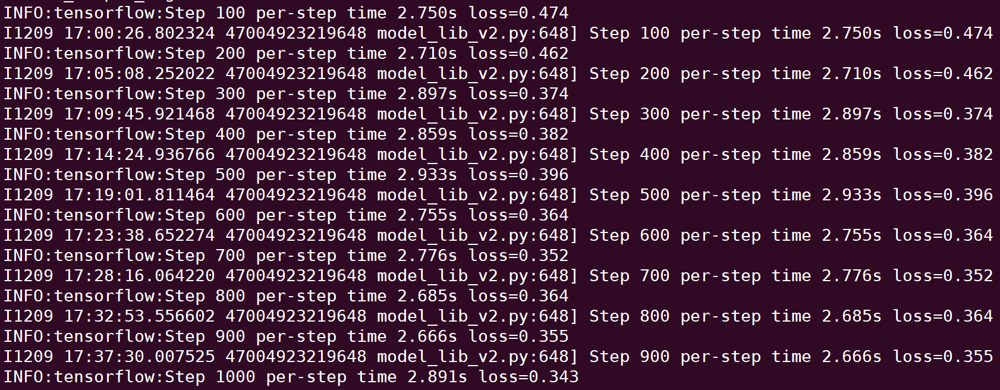

在训练过程中，会从命令行输出每100epoach的训练结果。在本文所部署的SSD-MobileNetV2模型，使用了NVIDIA Tesla V100显卡进行训练，训练约5-6小时后，结果开始逐步收敛，损失函数最终收敛到0.1以下，目标检测模型可以基本实现正确的检测。

### 3.8 TensorBoard查看训练进度

TensorBoard可以用于实时查看训练的进度如何，我们可以在命令行或jupyter notebook中调用TensorBoard，实时查看损失函数的下降情况以及训练的具体进度，这里我们用jupyter notebook进行查看，具体操作如下：

首先导入TensorBoard：

```python
%load_ext tensorboard

from tensorboard import notebook
notebook.list() 
```

接着输入训练对应文件夹，启用TensorBoard：

```python
notebook.start("--logdir models/research/object_detection/training")
```

我们可以在输出界面看到训练的具体情况：

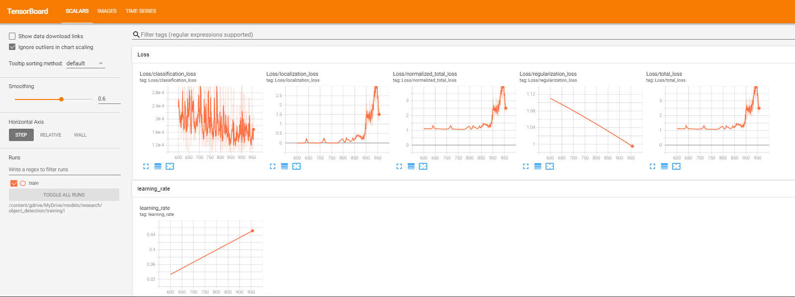

### 3.9 导出训练模型

接下来我们导出训练好的模型，并将模型转换为tflite格式。

#### 3.9.1 导出.pb格式模型

我们使用object_detection文件夹中的export_tflite_graph_tf2.py文件，先将模型导出：

```
python export_tflite_graph_tf2.py \
  --pipeline_config_path training/pipeline.config \
  --trained_checkpoint_dir training \
  --output_directory trainingModel
```

导出的模型位于object_detection/trainingModel文件夹，如果不需要部署到单片机或其他移动端设备，则可以对此模型直接使用。

#### 3.9.2 .pb格式模型转化为.tflite

tflite是为了将深度学习模型部署在移动端和嵌入式设备的工具包，可以把训练好的模型通过转化、部署和优化三个步骤，达到提升运算速度，减少内存、显存占用的效果。

我们需要对已有的模型进行转换，首先使用pip安装tf-nightly：

```
pip install tf-nightly
```

tf-nightly是支持tensorflow2的软件包，并首次被添加到tensorflow 2.3版本。

接下来我们使用tflite_convert对模型进行转换，将原有的模型转化为.tflite格式，在命令行中输入如下命令：

```
tflite_convert --saved_model_dir=trainingModel/saved_model --output_file=trainingModel/model.tflite
```

这时我们可以看到trainingModel文件夹中生成了model.tflite文件，此时我们便可以用此模型部署到树莓派上了。

## 四、深度学习部署

### 4.1 单片机简介

#### 4.1.1 硬件简介

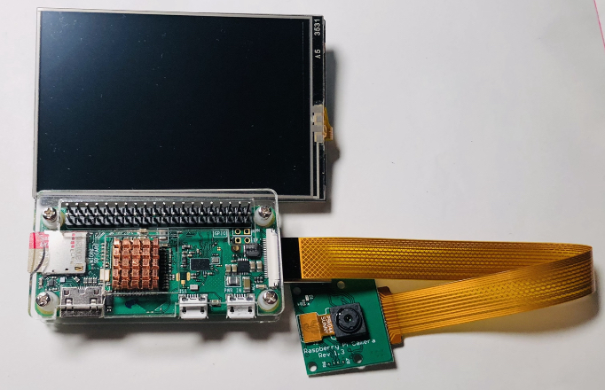

##### 树莓派zero w

在用树莓派部署深度学习过程中，我们选用树莓派zero w作为主要设备，树莓派zero w是树莓派系列最为基础的设备，搭载树莓派linux系统下，可以很好的运行程序。同时它还包括了wifi模块与蓝牙模块，方便pc与树莓派之间数据的传输。

树莓派zero主要参数如下：

- 博通 BCM2835 芯片 1GHz ARM11 core
- 512MB LPDDR2 SDRAM
- 一个 micro-SD 卡槽
- 一个 mini-HDMI 接口，支持 1080p 60hz 视频输出
- Micro-USB 接口用于供电和数据传输
- MicroUSB数据线，8G内存的MicroSD卡，用于烧制linux系统镜像

树莓派zero相比于其他型号树莓派，性能略有差异，但是仍可以胜任模型部署。

##### 摄像头

因为在训练模型过程中，我们对图片没有过高要求，仅采用较小像素图片进行训练，所以在实际使用时，我们使用500万像素摄像头进行拍摄，在实际使用中能够充分的发挥其作用。

##### 3.5寸显示屏

显示屏采用串口外接3.5寸显示屏，主要用于展示图像分类与目标检测的具体结果，屏幕为LCD显示屏，具有触摸功能，可以对系统进行具体的操控。

#### 4.1.2 软件环境

我们使用了**Raspberry Pi OS + python3.7**作为我们的软件环境。

Raspberry Pi OS环境自带python2.X版本，但是我们深度学习框架需要3.X以上的版本，所以需要在Linux系统中配置python环境。

在python官网下载后，选择源码安装，在通过xshell拷贝到linux系统中。通过文件传输将下载的压缩包上传后，通过yum-y命令安装依赖包和tar命令解压源码包。

```
./configure --prefix=/home/python3   
```

使用该命令为将要添加的python安装环境变量，在建立一个sh文件添加环境变量进去之后重载一下，linux系统下的python环境就配置完成了

### 4.2 树莓派环境搭建

#### 4.2.1 Raspberry Pi OS系统配置

##### 1.系统下载

我们使用Raspberry Pi Imager在SD卡上进行快速安装，首先在树莓派官网下载Raspberry Pi Imager：

[Raspberry Pi Imager下载](https://www.raspberrypi.org/software/)

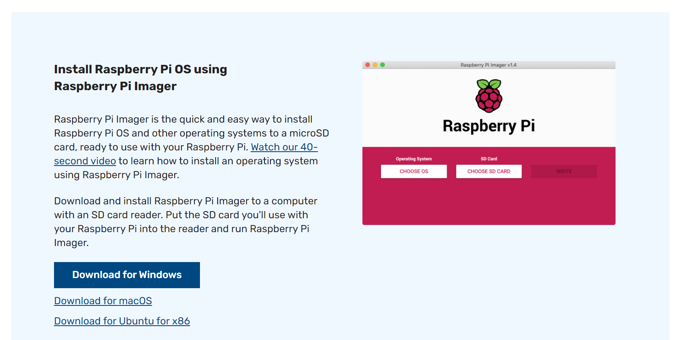

下载完成后，我们打开安装器，选择Raspberry Pi OS系统，并选择对应的SD卡进行系统安装。

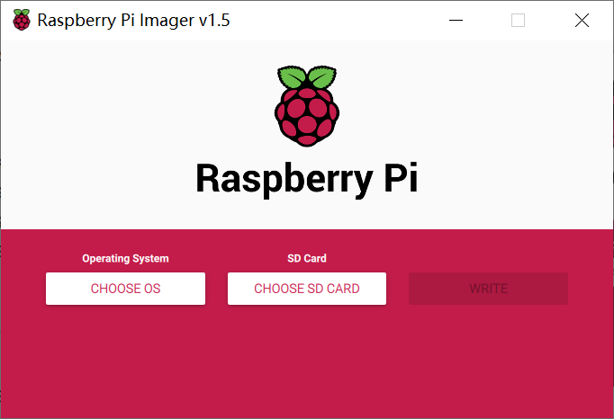

等待下载结束后，我们便得到了一张装有树莓派系统的SD卡。

##### 2.文件配置

我们将SD卡插入树莓派，并按照系统提示完成系统的安装：


接下来我们还需要对系统进行简单的配置。

+ root账户设置

  首先设置root账户密码：

  ```
  sudo passwd root
  ```

  接下来我们编辑文件，配置root远程登录的权限：

  ```
  nano /etc/ssh/sshd_config
  ```

  打开文件后，在文档末尾添加：

  ```
  PermitRootLogin yes
  PermitEmptyPasswords no
  PasswordAuthentication yes
  ```

  添加完成后，用ctrl+o 保存，ctrl+x 退出。

+ 摄像头连接树莓派

  首先将摄像头与树莓派相连，接着在命令行中输入：

  ```
  sudo raspi-config
  ```

  选择Interface Options—camera，选择yes，将摄像头权限开启，我们便可以使用树莓派进行摄像头拍照了。

  在命令行执行如下命令：

  ```
  raspistill -t 2000 -o image.jpg
  ```

  如果看到文件夹中新增了image.jpg文件，则代表配置成功。

#### 4.2.2 Tensorflow2安装

tensorflow lite支持树莓派3及以上的版本，如果使用的是以上版本的树莓派，则可以到以下网址进行tensorflow lite的下载和安装。

[tensorflow lite下载](https://www.tensorflow.org/lite/guide/python?hl=zh-cn)

由于树莓派zero不支持tensorflow lite，我们必须下载完整的Tensorflow2包，再从中调用Tensorflow lite模块。

以下是树莓派zero安装tensorflow2的具体方法。首先我们需要下载tensorflow2的arm编译版本，在[tensorflow arm编译版本下载](https://github.com/lhelontra/tensorflow-on-arm/releases/tag/v2.2.0)可以找到对应支持的版本。

因为我们使用的是python3.7，所以我们在树莓派命令行中输入：

```
wget https://github.com/lhelontra/tensorflow-on-arm/releases/download/v2.2.0/tensorflow-2.2.0-cp37-none-linux_armv6l.whl
```

下载完成后对文件进行重命名：

```
mv tensorflow-2.2.0-cp37-none-linux_armv6l.whl tensorflow-2.2.0-cp37-abi3-linux_armv6l.whl
```

然后使用pip3安装对应的.whl文件

```
sudo pip3 install tensorflow-2.2.0-cp37-abi3-linux_armv6l.whl
```

等待程序安装好后，我们便可以在树莓派zero上使用Tensorflow2了。输入如下命令进行测试：

```
python -c "import tensorflow as tf;print(tf.reduce_sum(tf.random.normal([100, 100])))"
```

如果出现了正确的输出，则代表tensorflow2安装成功。

#### 4.2.3 OpenCV安装

OpenCV的全称是Open Source Computer Vision Library，是一个跨平台的计算机视觉库，我们利用OpenCV操作树莓派进行拍照和图像的预处理。OpenCV在树莓派zero上的安装方法具体如下。

首先在命令行输入以下内容，安装必要的环境配置：

```
sudo apt-get -y install libjpeg-dev libtiff5-dev libjasper-dev libpng12-dev
sudo apt-get -y install libavcodec-dev libavformat-dev libswscale-dev libv4l-dev
sudo apt-get -y install libxvidcore-dev libx264-dev
sudo apt-get -y install qt4-dev-tools libatlas-base-dev
```

接下来我们使用pip3安装OpenCV：

```
pip3 install opencv-python==3.4.6.27
```

等待安装成功后，我们便可以使用OpenCV了。

### 4.3 树莓派部署模型

#### 4.3.1 图像分类模型部署

##### 1.导出为tensorflow模型

模型训练好之后会通过lastest_checkpoint命令导入最后一次训练的参数，checkpoint_dir是运行过程中得到的网络结构和权重值，作为暂时的值存储在文件夹里

```python
latest = tf.train.latest_checkpoint(checkpoint_dir)
model.load_weights(latest)
```

模型结构参数导出后，需要在重新运行一次，运行结果应该与训练过程的最后一次结果相同。

```python
model.compile(
        optimizer=tf.keras.optimizers.Adam(),
        loss=tf.keras.losses.sparse_categorical_crossentropy,
        metrics=["accuracy"]
    )

history = model.fit(ds_train,epochs=500,validation_data=ds_test,
                    callbacks = [tensorboard_callback, cp_callback])

```

此时的model包括了网络结构和权重参数，可以直接保存为h5文件，这里得到的h5文件大小为28.7M

```python
model.save('./data/moblie_2.h5')
```

##### 2.使用tflite部署

tflite是谷歌自己的一个轻量级推理库。主要用于移动端。之前的tensorflow mobile就是用的tflite部署方式，tflite使用的思路主要是从预训练的模型转换为tflite模型文件，拿到移动端部署。tflite的源模型可以来自tensorflow的saved model或者frozen model,也可以来自keras。

```python
model=tf.keras.models.load_model("./data/moblie_2.h5")
converter = tf.lite.TFLiteConverter.from_keras_model(model)
tfmodel = converter.convert()
open ("model.tflite" , "wb") .write(tfmodel)
```

通过此代码读取保存的h5文件经过convert处理后转换成tflite文件，此时得到的文件大小只有7.4M,大大的减小了模型大小。

##### 3.摄像头拍照

通过opencv包打开摄像头进行拍摄

```python
import cv2 as cv
def video_demo():
#0是代表摄像头编号，只有一个的话默认为0
    capture=cv.VideoCapture(0) 
    if not cap.isOpened():
        print("Cannot open camera")
        exit()
    while(True):
        ref,frame=capture.read()
 
        cv.imshow("1",frame)
#等待30ms显示图像，若过程中按“Esc”退出
        c= cv.waitKey(30) & 0xff 
        if c==27:
            capture.release()
            break    
```

cv.VideoCapture(0)表示读取视频，当输入为0时默认打开的是电脑摄像头。
read函数会返回两个值ref和frame，前者为true的时候表示获取到了图像，后者参数表示截取到的每一张图片。
cv.waitKey(30)&oxff: cv.waitKey(delay)函数如果delay为0就没有返回值，如果delay大于0，如果有按键就返回按键值，如果没有按键就在delay秒后返回-1，0xff的ASCII码为1111 1111，任何数与它&操作都等于它本身。`Esc`按键的ASCII码为27，所以当c==27时，摄像头释放。

```python
video_demo()
cv.destroyAllWindows()
```

最后通过cv.destroyAllWindows()函数清除所有的方框界面。

#### 4.3.2 目标检测模型部署

##### 1.导入tflite模型

首先我们需要在树莓派上下载Tensorflow Object Detection的API包，在树莓派命令行中输入：

```
git clone https://github.com/tensorflow/models
```

克隆完成后，将克隆的仓库进行重命名：

```
mv models-master models
```

下载目标检测API必要的软件包：

```
pip3 install tf_slim
pip3 install lvis
```

导入python的环境路径：

```
export PYTHONPATH=$PYTHONPATH:models/research/:models
```

接下来我们便可以进行目标检测模型的部署了。部署主要分为两部分，首先是加载tflite模型：

```python
import tensorflow as tf
import numpy as np
from object_detection.utils import visualization_utils as viz_utils
from object_detection.utils import config_util
from object_detection.builders import model_builder
import cv2


# 模型识别种类个数
num_classes = 16
# 模型位置
pipeline_config = 'pipeline.config'
# 模型标签
category_index = {1: {'id': 1, 'name': 'apple'}, 2: {'id': 2, 'name': 'banana'}, 3: {'id': 3, 'name': 'grape'}, 4: {'id': 4, 'name': 'kiwifruit'}, 5: {'id': 5, 'name': 'mango'}, 6: {'id': 6, 'name': 'orange'}, 7: {'id': 7, 'name': 'pear'}, 8: {'id': 8, 'name': 'stawberry'}, 9: {'id': 9, 'name': 'calla lily'}, 10: {'id': 10, 'name': 'cornflower'}, 11: {'id':11, 'name': 'corydalis'}, 12: {'id': 12, 'name': 'dahlia'}, 13: {'id': 13, 'name': 'daisy'}, 14: {'id': 14, 'name': 'gentian'}, 15: {'id': 15, 'name': 'nigella'}, 16: {'id': 16, 'name': 'sunflower'}}

# 定义模型
configs = config_util.get_configs_from_pipeline_file(pipeline_config)
model_config = configs['model']
model_config.ssd.num_classes = num_classes
model_config.ssd.freeze_batchnorm = True
detection_model = model_builder.build(model_config=model_config, is_training=True)

# 加载tflite文件
interpreter = tf.lite.Interpreter(model_path="model.tflite")
interpreter.allocate_tensors()
label_id_offset = 1
```

##### 2.OpenCV拍照与展示

接下来用OpenCV包进行实时拍照处理，并将拍照结果放入目标检测模型进行检测：

```python
# 定义摄像头
capture = cv2.VideoCapture(0)

while True:
    # 拍照并预处理照片
    ret, frame = capture.read()
    frame = cv2.flip(frame, 1)
    frame_rgb = cv2.cvtColor(frame, cv2.COLOR_BGR2RGB)
    test = np.expand_dims(frame_rgb, axis=0)
    input_tensor = tf.convert_to_tensor(test, dtype=tf.float32)
    # 目标检测模型进行检测
    boxes, classes, scores = detect(interpreter, input_tensor)
    viz_utils.visualize_boxes_and_labels_on_image_array(
        test[0],
        boxes[0],
        classes[0].astype(np.uint32) + label_id_offset,
        scores[0],
        category_index,
        use_normalized_coordinates=True,
        min_score_thresh=0.8)
    # 呈现检测结果
    frame = cv2.cvtColor(test[0], cv2.COLOR_BGR2RGB)
    cv2.imshow("Object detector", frame)
    c = cv2.waitKey(20)
    # 如果按q键，则终止
    if c == 113:
        break
cv2.destroyAllWindows()
```

### 4.4 服务器改进部署方式

#### 4.4.1 Flask框架的搭建

Flask是一个使用python编写的轻量级web应用框架，主要用来接收和发送数据。当树莓派端Flask发送Post请求时，Flask可以使用Request包获取传来的数据，并将计算结果作为Post请求的返回值返回给树莓派

在服务器中使用Flask框架时，我们需要引入flask包，并定义函数，这样当接收到树莓派请求时，程序便会执行对应的函数，并将结果返回给树莓派。

以下是一个简单的Flask框架搭建：

```python
from flask import Flask
app = Flask(__name__)

@app.route('/', methods=["post"])
def index():
    return "<h1 style='color:red'>hello world!</h1>"

if __name__ == '__main__':
    app.run(host='192.168.1.1', debug=True)
```

云服务器使用flask时，只需要将端口号对应的函数上面使用装饰器，并在主函数运行主端口号即可。

```python
if __name__ == '__main__':
    app.run(host='192.168.1.1', debug=True, port=8888)
```

#### 4.4.2 Nginx+uwsgi的配置

单纯使用flask框架构造简单,但是器并发性效果较差，我们可以改进部署方式，选用Nginx + uwsgi + flask的部署方式增加稳定性。

首先安装Nginx，用如下命令进行安装：

```
apt install nginx
```

安装完成后对Nginx进行配置，具体的配置因服务器的具体情况而定：

```
server {
        listen 80;  # 监听端口，http默认80
        server_name _; # 填写域名或者公网IP
        location / {
                include uwsgi_params;   # 使用nginx内置的uwsgi配置参数文件
                uwsgi_pass 127.0.0.1:8088;   # 转发请求到该地址端口
                uwsgi_param UWSGI_SCRIPT main:app;   # 调用的脚本名称和application变量名
        }
}
```

最后启动Nginx：

```
service nginx start
```

接下来安装uwsgi：

```
pip install -i https://pypi.tuna.tsinghua.edu.cn/simple uwsgi
```

查看uwsgi的版本，若显示则表示安装成功：

```
uwsgi --version
```

接下来我们创建uwsgi的配置文件，在命令行中输入：

```
vim main.ini
```

将以下内容输入到文本当中，其中wsgi-file为部署模型的python程序名，在文章之后会有程序的具体内容；socket为Nginx的转接地址；threads为同时开启的线程数，如需要同时调试多个模型，请增大线程数：

```
[uwsgi]
master = true
wsgi-file = main.py
callable = app
socket = 127.0.0.1:8001
processes = 4
threads = 2
buffer-size = 32768
```

全部配置完成后，运行只需要输入：

```
uwsgi main.ini
```

#### 4.4.3 图像分类模型部署

单片机运算内存较小，用其自带的运算器计算速度很慢，因此我们可以使用云服务器加持，从树莓派端收集图片，在树莓派端进行图片裁剪后发送给云服务器进行模型导入计算，并返回label值给树莓派。

##### 1.树莓派端图像裁剪

树莓派端通过调用opencv的摄像头函数采集图像后，进行图像缩放及图像均值化等简单操作，把图像缩放成224*224大小，并用直方图均值化的方法处理光照不均，最后通过端口发送图片给云服务器

```python
def load_image(img_path, size=(224, 224)):
    img = tf.io.read_file(img_path)
    img = tf.image.decode_jpeg(img)
    img = tf.image.resize(img, size)/255.0
    return img
```

##### 2.服务器端模型分类

云服务器端首先加载之前处理好的tflite模型文件，导入训练好的模型骨架和参数。

```python
def evaluate_model(interpreter, test_image):
    input_index = interpreter.get_input_details()[0]["index"]
    output_index = interpreter.get_output_details()[0]["index"]
    test_image = np.expand_dims(test_image, axis=0).astype(np.float32)
    interpreter.set_tensor(input_index, test_image)
    interpreter.invoke()
    output = interpreter.tensor(output_index)
    output = np.argmax(output()[0])
    return output
```

通过8089这个端口号接收到图片后，将图片暂存之文件夹内，并读取该图片放入到预加载好的模型里

```python
interpreter = tf.lite.Interpreter(model_path='MobileNetV2.tflite')
interpreter.allocate_tensors()
```

此模型共分为30类

```python
classlist = ["apple", "banana", "blueberry", "cherry", "durian", "fig", "grape", "lemon", "litchi", "mango", "orange", "pineapple", "plum", "pomegranate", "strawberry", "aster", "begonia", "calla_lily", "chrysanthemum", "cornflower", "corydali", "dahlia", "daisy", "gentian", "mistflower", "nigella", "rose", "sandwort", "sunflower", "veronica"]
```

每次计算都会得到一个0到29的索引值，云服务器会根据索引值索引到类别，返回字符串给树莓派端。

```python
@app.route('/', methods=['post'])
def predict():
    upload_file = request.files['file']
    file_name = upload_file.filename
    file_path = '/home/ubuntu/inifyy/img'
    if upload_file:
        file_paths = os.path.join(file_path, file_name)
        upload_file.save(file_paths)
    test = load_image(file_paths)
    result = evaluate_model(interpreter, test)
    result = classlist[result]
    return result
```

#### 4.4.4 目标检测模型部署

##### 1.树莓派端数据发送

树莓派端首先用OpenCV包进行拍照与图像处理，接着利用requests模块发送post请求，并等待服务器返回运行结果，具体的部署代码如下：

```python
import requests
import numpy as np
import cv2


# 服务器公网地址
url = "http://127.0.0.1:8088/"
# post图片格式
content_type = 'image/jpeg'
headers = {'content-type': content_type}
# 定义摄像头
capture = cv2.VideoCapture(0)
while True:
    # 拍照与图片预处理
    ret, frame = capture.read()
    frame = cv2.resize(frame, (160, 120), interpolation=cv2.INTER_CUBIC)
    # 将图片数据编码并发送
    img_encoded = cv2.imencode('.jpg', frame)[1]
    imgstring = np.array(img_encoded).tobytes()
    response = requests.post(url, data=imgstring, headers=headers)
    imgstring = np.asarray(bytearray(response.content), dtype="uint8")
    # 展示返回结果
    img = cv2.imdecode(imgstring, cv2.IMREAD_COLOR)
    cv2.imshow("video", img)
    c = cv2.waitKey(20)
    # 如果按q键，则终止
    if c == 113:
        break
cv2.destroyAllWindows()
```

##### 2.服务器端模型检测

服务器端的模型部署与之前在树莓派上部署模型类似，都用到了Tensorflow Object Detection的API。

首先我们需要在树莓派上下载Tensorflow Object Detection的API包，在树莓派命令行中输入：

```
git clone https://github.com/tensorflow/models
```

克隆完成后，将克隆的仓库进行重命名：

```
mv models-master models
```

下载目标检测API必要的软件包：

```
pip3 install tf_slim
pip3 install lvis
```

导入python的环境路径：

```
export PYTHONPATH=$PYTHONPATH:models/research/:models
```

接下来我们便可以进行目标检测模型的部署了，具体部署代码如下：

```python
import tensorflow as tf
import numpy as np
from object_detection.utils import visualization_utils as viz_utils
from object_detection.utils import config_util
from object_detection.builders import model_builder
import cv2
from flask import Flask, request
app = Flask(__name__)


# 定义检测函数
def detect(interpreter, input_tensor):
  input_details = interpreter.get_input_details()
  output_details = interpreter.get_output_details()
  preprocessed_image, shapes = detection_model.preprocess(input_tensor)
  interpreter.set_tensor(input_details[0]['index'], preprocessed_image.numpy())
  interpreter.invoke()
  boxes = interpreter.get_tensor(output_details[0]['index'])
  classes = interpreter.get_tensor(output_details[1]['index'])
  scores = interpreter.get_tensor(output_details[2]['index'])
  return boxes, classes, scores


# 模型识别种类个数
num_classes = 16
# 模型位置
pipeline_config = 'pipeline.config'
# 模型标签
category_index = {1: {'id': 1, 'name': 'apple'}, 2: {'id': 2, 'name': 'banana'}, 3: {'id': 3, 'name': 'grape'}, 4: {'id': 4, 'name': 'kiwifruit'}, 5: {'id': 5, 'name': 'mango'}, 6: {'id': 6, 'name': 'orange'}, 7: {'id': 7, 'name': 'pear'}, 8: {'id': 8, 'name': 'stawberry'}, 9: {'id': 9, 'name': 'calla lily'}, 10: {'id': 10, 'name': 'cornflower'}, 11: {'id':11, 'name': 'corydalis'}, 12: {'id': 12, 'name': 'dahlia'}, 13: {'id': 13, 'name': 'daisy'}, 14: {'id': 14, 'name': 'gentian'}, 15: {'id': 15, 'name': 'nigella'}, 16: {'id': 16, 'name': 'sunflower'}}

# 定义模型
configs = config_util.get_configs_from_pipeline_file(pipeline_config)
model_config = configs['model']
model_config.ssd.num_classes = num_classes
model_config.ssd.freeze_batchnorm = True
detection_model = model_builder.build(model_config=model_config, is_training=True)

# 加载tflite文件
interpreter = tf.lite.Interpreter(model_path="model.tflite")
interpreter.allocate_tensors()
label_id_offset = 1


# 定义预测函数，用于接受post及预测
@app.route('/', methods=["post"])
def predict():
    # 解码接收的图像文件
    imgstring = np.asarray(bytearray(request.data), dtype="uint8")
    img = cv2.imdecode(imgstring, cv2.IMREAD_COLOR)
    frame = cv2.cvtColor(img, cv2.COLOR_BGR2RGB)
    test = np.expand_dims(frame, axis=0)
    # 目标检测
    input_tensor = tf.convert_to_tensor(test, dtype=tf.float32)
    boxes, classes, scores = detect(interpreter, input_tensor)
    viz_utils.visualize_boxes_and_labels_on_image_array(
        test[0],
        boxes[0],
        classes[0].astype(np.uint32) + label_id_offset,
        scores[0],
        category_index,
        use_normalized_coordinates=True,
        min_score_thresh=0.8)
    #返回运算结果
    frame = cv2.cvtColor(test[0], cv2.COLOR_BGR2RGB)
    img_encoded = cv2.imencode('.jpg', frame)[1]
    imgstring = np.array(img_encoded).tobytes()
    return imgstring

if __name__ == '__main__':
    app.run(debug=True, host='127.0.0.1', port=8088)
```